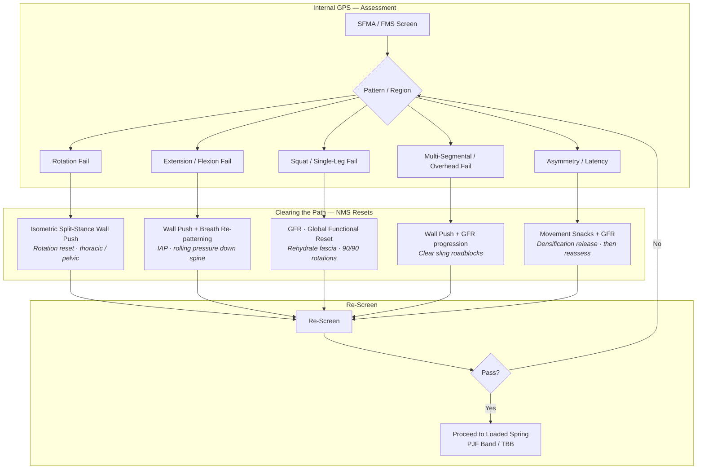

# Vertical Velocity Academy — Corrective Loop Flowchart

**Role:** Senior Instructional Designer & Sports Scientist (Biomechanics / Neuroscience)  
**Project:** Vertical Velocity Academy — Elijah Bonds  
**Philosophy:** CNS Freeway · Tensegrity · SFMA/FMS → NMS Roadblock identification and reset before loading.

---

## Corrective Loop: SFMA Failure → NMS Reset Strategy

Flowchart pairing **SFMA/FMS failure patterns** (neuromuscular signal roadblocks) with the appropriate **NMS reset** before progression. No loading until the path is cleared.

---

## Pairing Table: SFMA Failure → NMS Reset

| SFMA / FMS Failure (Roadblock) | Primary NMS Reset | Rationale |
|-------------------------------|-------------------|-----------|
| **Rotation fail** (cervical, thoracic, or pelvic) | **Isometric split-stance wall push** | Restores rotational bias and clears fascial densification in spiral/functional sling. |
| **Extension / flexion fail** | **Wall push + breath re-patterning** | IAP cueing (“rolling pressure down the spine”) resets diaphragm–pelvic floor; reduces compression roadblocks. |
| **Squat or single-leg fail** | **GFR (Global Functional Reset)** | Full-body rehydration; 90/90 seated/floor rotations to address adhesion before re-loading. |
| **Multi-segmental / overhead fail** | **Wall push + GFR progression** | Clear sling path (Anatomy Trains); then GFR to prevent recurrence. |
| **Asymmetry / timing / latency** | **Movement snacks + GFR** | Address densification first; reassess before loading. |

---

## Execution Notes

- **Terminology:** Fascial rehydration, NMS release, densification (Stecco), roadblock.
- **Equipment:** Bodyweight, PJF Extended Band, Total Body Board (TBB) only.
- **Cues:** “Push 1, 2” (penultimate); “Rolling pressure down the spine” (breath-work).
- **Rule:** A fail = neuromuscular signal roadblock → apply the paired reset → re-screen → only then progress to Loaded Spring / Elastic Engine.

---

*Vertical Velocity Academy — Corrective Loop · Elijah Bonds*
