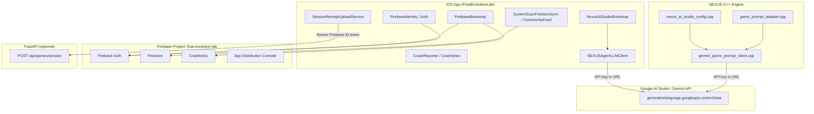

# NEXUS AI Studio Migration (Firebase → Gemini LLM plane)

**Status:** Phase 1 complete — plan only; **no Firebase deletion**  
**Canonical repo:** `/Users/elijahbonds/Final-Evolution-Lab`  
**Vision refs:** `docs/NEXUS_GAME_GENERATOR.md`, `docs/NEXUS_AI_STUDIO_SETUP.md`, `infra/FIREBASE_IOS_SDK.md`, `infra/FIREBASE_APP_DISTRIBUTION.md`  
**Last updated:** 2026-06-27

---

## Executive summary

NEXUS already calls **Google AI Studio / Gemini REST** directly (`generativelanguage.googleapis.com/v1beta`) via API keys — it does **not** use the Firebase AI Logic iOS SDK. This migration **formalizes ownership**:

| Plane | Owner | Examples |
|-------|-------|----------|
| **Mobile platform** | **Firebase** | Auth, Crashlytics, Firestore, App Distribution (console) |
| **Generative AI** | **Google AI Studio** | Game generator, agent tool planner, NEXUS Studio AI |

**Do not remove Firebase SDK** in this program. AI Studio replaces the **LLM plane**, not auth, crash, distribution, or Firestore.

Primary key env var: **`NEXUS_AGENT_GEMINI_KEY`** (aliases: `NEXUS_AI_STUDIO_API_KEY`, `GEMINI_API_KEY`, `FEL_LLM_KEY`). See `docs/NEXUS_AI_STUDIO_SETUP.md`.

---

## 1. Downloads scan (`~/Downloads/`)

**Scan date:** 2026-06-27

| File | Notes |
|------|--------|
| `GoogleService-Info.plist` | Production Firebase iOS config |
| `GoogleService-Info (1).plist` | Duplicate of above |

**Both plists match NEXUS ship target** (metadata only — do not commit):

- `BUNDLE_ID`: `com.finalevolutionlab.app`
- `PROJECT_ID`: `final-evolution-lab`
- `GOOGLE_APP_ID`: `1:760396881212:ios:279a55f97749059acb1239` (matches `infra/FIREBASE_APP_DISTRIBUTION.md`)

**Not found in Downloads:**

- Abacus exports or `.abacus` archives
- AI Studio JSON config files
- Gemini key files
- `.zip` bundles (Abacus, Luma, Meshy, or other asset drops)

**Action (Phase 3):** Copy one plist to `FinalEvolutionLab/GoogleService-Info.plist` (gitignored) and run `./scripts/lib/firebase-plist-check.sh validate`. **Do not commit the plist.**

**Action (Phase 2):** Create AI Studio API keys at https://aistudio.google.com/apikey — no key artifacts were found on disk.

---

## 2. Key document reads

### `.abacus.donotdelete`

- Present in mirror repo; contents are **Fernet-encrypted** (not human-readable in scan).
- Abacus is referenced elsewhere as architecture/design source of truth (`release-reference/README.md`, Seele asset packages) — separate from Firebase/Gemini runtime.

### `SEELE_AI_EXECUTION_PACKAGE.md` (mirror)

- Legacy UE 5.7 / Google Play execution package.
- Firebase listed for Crashlytics, Remote Config, Analytics, FCM — **not** aligned with current NEXUS iOS pivot (TestFlight / NEXUS engine).
- Useful for economy/session receipt schema context; **not** the NEXUS ship architecture doc.

### `infra/FIREBASE_IOS_SDK.md` (canonical)

- SPM `firebase-ios-sdk` **12.15.0**, products linked:
  - `FirebaseCore`, `FirebaseAuth`, `FirebaseFirestore`, `FirebaseCrashlytics`
- **Not linked:** Analytics, App Distribution SDK, Messaging, Remote Config
- Plist path: `FinalEvolutionLab/GoogleService-Info.plist` (gitignored; example at `GoogleService-Info.example.plist`)

### `docs/NEXUS_GAME_GENERATOR.md` (canonical)

- Template MVP (18 modes) + optional **Gemini-assisted** tier via env keys
- Keys: `NEXUS_AGENT_GEMINI_KEY`, `NEXUS_AI_STUDIO_API_KEY`, `GEMINI_API_KEY`, `FEL_LLM_KEY`
- Default model: `gemini-2.0-flash` (`NEXUS_AGENT_GEMINI_MODEL` override)
- Honest PREVIEW: Gemini only assists mode/difficulty/arena intent; registry owns truth

---

## 3. Touchpoint map: Firebase vs Gemini / AI Studio

### Architecture diagram (current state)



### Firebase touchpoints (keep vs migrate)

| Surface | Location | Role today | Migration stance |
|---------|----------|------------|------------------|
| **Bootstrap / plist** | `FirebaseBootstrap.swift`, build phase verify | Gates live vs PREVIEW lane | **KEEP** — required for Auth/Crashlytics/Firestore |
| **Auth (anonymous)** | `FirebaseIdentity.swift` | UID for Firestore; ID token for receipt POST | **KEEP** (Phase 8 may evaluate API-key auth alternative for receipts only) |
| **Session receipt POST** | `NexusBackendClient.swift`, `SessionReceiptUploadService.swift` | `POST /api/games/session` with Firebase Bearer; gated by `canPostSessionReceipts` | **KEEP Firebase Auth as gate** until backend accepts another auth model (**V-012 OPEN**) |
| **Crashlytics** | `CrashReporter.swift`, Release upload build phase | Crash/ANR telemetry | **KEEP** |
| **Firestore** | `SystemScanFirestoreSync.swift`, `CommunityFeedView.swift` | Health scan snapshots, social feed | **KEEP** (not replaced by AI Studio) |
| **App Distribution** | `infra/FIREBASE_APP_DISTRIBUTION.md`, ad-hoc IPA scripts | Internal tester sideload (no ASC) | **KEEP** — console upload only, no SDK |
| **Hosting / emulators** | `firebase.json` | Local dev emulators (Auth 9099, Firestore 8085) | **KEEP** for dev |
| **Remote Config / Analytics / FCM** | Referenced in Seele doc only | Not linked in NEXUS iOS target | **No action** — not in ship path |

**Receipt lane logic (critical):**

```swift
// FinalEvolutionLab/Services/NexusBackendClient.swift
static var canPostSessionReceipts: Bool {
    FirebaseBootstrap.isConfigured && !FirebaseBootstrap.isPreviewMode
}
```

Preview builds queue receipts to `~/.fel/pending_receipts/` and skip POST honestly.

### Gemini / AI Studio touchpoints (already exist)

| Surface | Location | API | Key source |
|---------|----------|-----|------------|
| Config resolution | `engine/ai_interface/src/nexus_ai_studio_config.cpp`, `NexusAIStudioConfigService.swift` | Env → optional Downloads JSON → Keychain | `NEXUS_AGENT_GEMINI_KEY` / aliases |
| Game generator hints | `engine/ai_interface/src/gemini_game_prompt_client.cpp` | `generativelanguage.googleapis.com/v1beta/models/{model}:generateContent?key=` | Same env keys |
| Agent tool planner | `FinalEvolutionLab/Services/NEXUSAgentLLMClient.swift` | Same REST surface + function calling | Same env keys |
| Template fallback | `app/gameplay/src/game_prompt_adapter.cpp` | No network | Always available offline |
| Unit tests | `tests/unit/gameplay/gameplay_test.cpp` | Stub transport | CI-safe |

**Important:** NEXUS calls **Google AI Studio / Gemini REST directly** with API keys. It does **not** use the Firebase AI Logic iOS SDK. `GEMINI_API_KEY` is documented as a compatibility alias only.

---

## 4. What stays vs what AI Studio owns

| Concern | Owner after migration |
|---------|----------------------|
| Internal IPA distribution | **Firebase App Distribution** (console) |
| Crash reporting | **Firebase Crashlytics** |
| User identity for receipts + Firestore | **Firebase Auth** (for now) |
| Health scan / social persistence | **Firestore** |
| Natural language → game spec | **Google AI Studio** (Gemini API via `NEXUS_AGENT_GEMINI_KEY`) |
| In-app agent tool planning | **Google AI Studio** |
| Session economy POST | **FastAPI backend** (auth via Firebase JWT today) |
| Optional backend LLM proxy | **Google AI Studio** (Phase 7 — if keys must not live on device) |

---

## 5. Ten-phase migration plan

### Phase 1 — PM / Architect ✅

- Inventory Downloads, plist state, Firebase vs Gemini touchpoints
- Publish this architecture doc + `artifacts/coord/phase1_pm_handoff.json`
- **Gate:** Stakeholder sign-off on “Firebase stays for platform; AI Studio owns LLM”

### Phase 2 — Credential & secrets governance

- Create AI Studio API keys per environment (dev / CI / prod)
- Document rotation in `infra/AI_STUDIO_SECRETS.md`
- Map: Xcode scheme env, Cursor shell, GitHub Actions secrets, `.env.example`
- Deprecate `FEL_LLM_KEY` alias on a timeline
- **Gate:** Keys never committed; mirror repo gets doc pointers only

### Phase 3 — Firebase live lane (prerequisite, parallel-safe)

- Install production plist from Downloads → `FinalEvolutionLab/GoogleService-Info.plist`
- Run `./scripts/archive-ios-testflight.sh --export` (or `--export-adhoc` for Firebase Distribution)
- Verify `FirebaseBootstrap.isPreviewMode == false`, Crashlytics upload policy documented
- **Gate:** **V-003** evidence bundle; honest removal of PREVIEW banner when live

### Phase 4 — Gemini client contract unification

- Single shared spec: model default, env key precedence, error taxonomy, rate-limit handling
- Align C++ (`gemini_game_prompt_client.cpp`) and Swift (`NEXUSAgentLLMClient.swift`) response parsing
- Add `metadata.llm_provider: "google_ai_studio"` in generator specs
- **Gate:** Headless tests pass; stub transport unchanged for CI

### Phase 5 — Game Generator AI Studio hardening

- Promote `gemini_assisted` from optional to **recommended** when key present
- UI surfaces adapter tier in `NexusGameGeneratorView` (template vs Gemini)
- Enforce `params.force_template` for deterministic CI
- **Gate:** 18-mode template fallback still works with `NEXUS_FIREBASE_DISABLED=1` and no Gemini key

### Phase 6 — NEXUS Agent LLM hardening

- Default backend selection policy: localStub in DEBUG without key; Gemini when keyed
- Tool-call parity with `docs/NEXUS_AGENT_TOOLS.md`
- Rate-limit / 429 backoff; user-facing errors via existing toast patterns
- **Gate:** Agent chip smoke in simulator product test doc

### Phase 7 — Optional backend Gemini proxy (security)

- Evaluate moving API keys off-device for production (FastAPI route → Gemini)
- iOS/engine call proxy with Firebase-authed requests
- **Gate:** Only if threat model requires; otherwise document “keys in scheme OK for internal TestFlight”

### Phase 8 — Session receipt live POST verification

- With Phase 3 plist: drain `~/.fel/pending_receipts/` → live `POST /api/games/session`
- Close **V-012** with end-to-end proof (JWT + 2xx + shard/PRQ apply via `NexusEconomyAuthority`)
- **Gate:** Do not conflate receipt auth migration with AI Studio migration

### Phase 9 — CI/CD & preview lanes

- CI: template-only generator (`force_template`); no live Gemini in default gate
- Nightly optional job with `NEXUS_AGENT_GEMINI_KEY` secret for live Gemini smoke
- `--preview-firebase` lane unchanged for PR builds
- **Gate:** `nexus_build_gate.sh` green without secrets

### Phase 10 — Soak, docs sync, fleet handoff

- Update `NEXUS_VISION_ALIGNMENT.md`, `NEXUS_DELIVERY_MATRIX.md`, mirror `README_NEXUS_CANONICAL.md` pointer
- 72h soak: generator + agent with AI Studio key on internal devices
- Fleet status: mark AI Studio migration COMPLETE; Firebase scope frozen
- **Gate:** No Firebase SDK removal; documented ownership matrix signed off

---

## 6. Blockers & immediate wins

| Item | Vision ID | Status | Owner phase |
|------|-----------|--------|-------------|
| Production plist in repo workspace | **V-003** | **Available in Downloads**, not yet installed in canonical tree | Phase 3 |
| Live receipt POST end-to-end | **V-012** | Blocked on live Firebase + backend | Phase 8 |
| Gemini REST clients wired | — | **Done** — C++ and Swift exist | Phase 4–6 harden |
| `.abacus.donotdelete` | — | Encrypted vault — needs Abacus tooling to decode | Out of band |
| No AI Studio key artifacts in Downloads | — | Create keys in Google AI Studio console | Phase 2 |

### V-003 (P0 — ship artifact)

No signed TestFlight archive / IPA with **production** `GoogleService-Info.plist` in the canonical workspace. Preview lane (`--preview-firebase`) is live but does **not** close V-003. See `docs/NEXUS_VISION_ALIGNMENT.md`.

**Mitigation:** Copy plist from `~/Downloads/` → `./scripts/lib/firebase-plist-check.sh validate` → `./scripts/archive-ios-testflight.sh --export`.

### V-012 (P2 — DoD gap)

Live Firebase session receipt POST (Spec v1 #4) not verified end-to-end. Queue + drain wired; production 2xx proof still required. See `docs/NEXUS_BACKEND_CONTRACT.md`.

**Mitigation:** Phase 3 plist + Phase 8 drain test with real Anonymous Auth + backend 2xx.

---

## 7. Recommended parallel follow-up

Run **Phase 2** (AI Studio key governance) in parallel with **Phase 3** (install production Firebase plist from Downloads) — unblocks both LLM hardening and V-003/V-012.

**Do not delete Firebase** until Phases 8–10 confirm receipt, crash, and distribution paths with the reduced scope documented above.

---

## 8. Related docs

| Doc | Purpose |
|-----|---------|
| `docs/NEXUS_AI_STUDIO_SETUP.md` | How to get and configure API keys (no Firebase required for AI) |
| `docs/NEXUS_GAME_GENERATOR.md` | Generator tiers: template vs Gemini-assisted |
| `docs/NEXUS_BACKEND_CONTRACT.md` | Session receipt POST contract + V-012 close criteria |
| `infra/FIREBASE_IOS_SDK.md` | Firebase SPM products and plist policy |
| `infra/FIREBASE_APP_DISTRIBUTION.md` | Ad-hoc IPA sideload via Firebase console |
| `docs/NEXUS_VISION_ALIGNMENT.md` | V-003 / V-012 drift registry |
