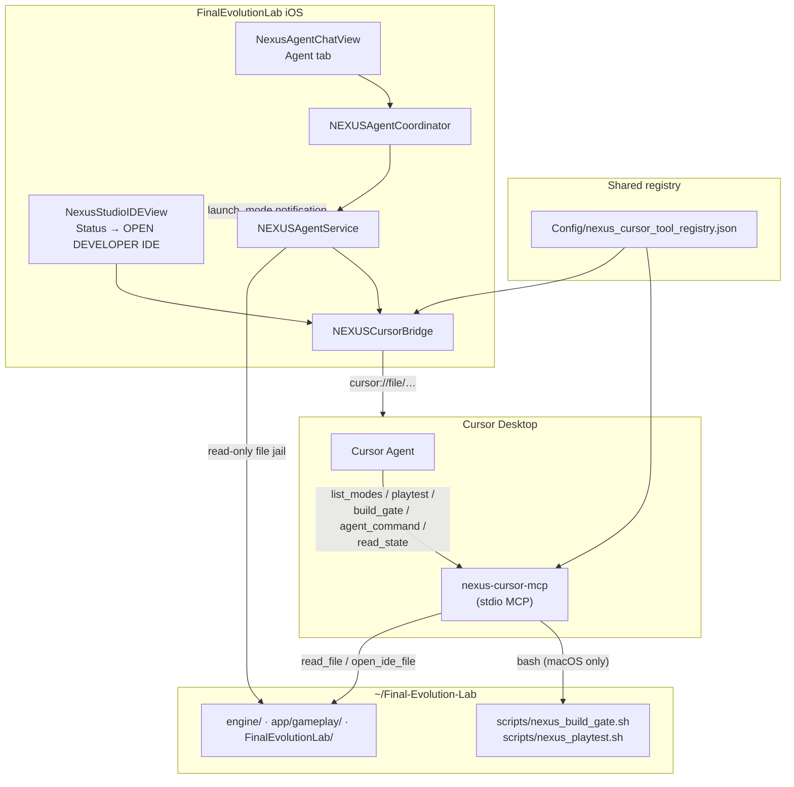

# NEXUS Cursor Bridge

Shared protocol between **Cursor MCP** (desktop agent) and **NEXUS Agent** (in-app chat + NEXUS Studio IDE). Both hosts read the same whitelisted tool registry and target the canonical repo at `~/Final-Evolution-Lab`.

## Canonical registry

| Artifact | Path |
| --- | --- |
| **Tool registry (source of truth)** | `Config/nexus_cursor_tool_registry.json` |
| **Cursor MCP config** | `.cursor/mcp.json` |
| **MCP server (canonical)** | `tools/nexus-cursor-mcp/dist/index.js` |
| **In-app executor** | `FinalEvolutionLab/Services/NEXUSAgentService.swift` |
| **Shared bridge helpers** | `FinalEvolutionLab/Services/NEXUSCursorBridge.swift` |

**Repo root resolution (both hosts):**

1. `NEXUS_REPO_ROOT` (Agent tab / MCP)
2. `FEL_NEXUS_REPO_ROOT` (NEXUS Studio IDE)
3. Default: `/Users/elijahbonds/Final-Evolution-Lab`

## Unified MCP surface tools

These five names are identical in Cursor MCP and in-app chat:

| Tool | Purpose | iOS app | Cursor MCP (macOS) |
| --- | --- | --- | --- |
| `list_modes` | Arena registry + sprint priority | In-process `GameModeRegistry` | Parses `arena_mode_registry.cpp` + capability doc |
| `playtest` | Launch / validate a mode | Posts `NEXUSAgentLaunchMode` → Arena | Runs `scripts/nexus_playtest.sh` |
| `nexus_scan_playtest` | Scan envelope unit smoke | Blocked on device | Runs `nexus_scan_envelope_test` in `NEXUS_BUILD_DIR` |
| `build_gate` | NEXUS CI preflight | Blocked on device; returns manual command | Runs `scripts/nexus_build_gate.sh` or validate script |
| `agent_command` | Route whitelisted sub-tools | Sandboxed dispatch in Swift | Sandboxed dispatch in Node |
| `read_state` | Delivery matrix + build/playtest artifacts | Blocked on device | Reads `NEXUS_DELIVERY_MATRIX.md` + artifact logs |

### Aliases (registry → executor)

| MCP / chat name | Canonical executor |
| --- | --- |
| `build_gate` | `run_build_gate` |
| `playtest` | `launch_mode` |

### `agent_command` routes

Sub-tools allowed via `{ "tool": "…", "arguments": { … } }`:

`list_modes`, `playtest`, `nexus_scan_playtest`, `build_gate`, `run_build_gate`, `launch_mode`, `read_file`, `creative_command`, `scan_to_generate`, `open_ide_file`

## Integration diagram



## Cursor deep links

| Action | URI pattern | Where exposed |
| --- | --- | --- |
| Open repo root | `cursor://file/{repo_root}` | Agent tab **Open in Cursor**, Studio toolbar menu |
| Open file | `cursor://file/{absolute_path}` | `open_ide_file` tool payload, Studio **Open file in Cursor** |
| Open file at line | `cursor://file/{absolute_path}:{line}` | `open_ide_file` with `line` arg |

On iOS, paths are also copied to the pasteboard when tools or UI actions run.

## Setup

### 1. Cursor MCP (desktop)

```bash
cd ~/Final-Evolution-Lab/tools/nexus-cursor-mcp
npm install
npm run build
```

`.cursor/mcp.json` is already wired:

```json
{
  "mcpServers": {
    "nexus": {
      "command": "node",
      "args": ["tools/nexus-cursor-mcp/dist/index.js"],
      "env": {
        "NEXUS_REPO_ROOT": "/Users/elijahbonds/Final-Evolution-Lab",
        "NEXUS_BUILD_DIR": "build-headless",
        "NEXUS_RUNTIME_BUILD_DIR": "build-full"
      }
    }
  }
}
```

Restart Cursor → MCP tools `list_modes`, `playtest`, `nexus_scan_playtest`, `build_gate`, `agent_command`, and `read_state` appear for the agent.

### 2. In-app Agent (iOS)

1. Xcode scheme env: `NEXUS_REPO_ROOT=/Users/elijahbonds/Final-Evolution-Lab`
2. Run app → **Agent** tab → `NexusAgentChatView`
3. Local stub understands MCP names; set `NEXUS_AGENT_GEMINI_KEY` for Gemini function calling

### 3. NEXUS Studio IDE

1. Xcode scheme env: `FEL_NEXUS_REPO_ROOT=/Users/elijahbonds/Final-Evolution-Lab`
2. **Status** → **OPEN DEVELOPER IDE**
3. Toolbar `</>` menu → **Open repo in Cursor** or **Open file in Cursor**

See also: `docs/NEXUS_STUDIO_IDE.md`, `docs/NEXUS_AGENT_TOOLS.md`, `docs/CURSOR_NEXUS_CONTROL.md`

## Example flows

### Cursor: full build gate

```
User: Run NEXUS build gate
Cursor: [build_gate target=full_gate] → scripts/nexus_build_gate.sh stdout
```

### In-app: playtest dunk

```
User: playtest basketball_dunk
Agent: [playtest mode_id=basketball_dunk] → Arena tab GamePlayView
```

### Cross-host: read via agent_command

```
User: agent_command read_file NEXUS_ONLY_PIVOT.md
Cursor: [agent_command tool=read_file] → markdown payload
iOS:    same registry route → identical sandbox rules
```

## Security (both hosts)

1. No arbitrary shell — only whitelisted scripts under `scripts/`
2. Path jail — repo-relative reads; no `..` or absolute paths
3. No repo writes from tools — Studio sandbox only for edits
4. `creative_command` — C++ bridge on iOS only; MCP returns blocked payload with hint
5. Action log — best-effort append to `docs/NEXUS_AGENT_TOOLS.md` when repo writable

## Files in this bridge

| File | Role |
| --- | --- |
| `Config/nexus_cursor_tool_registry.json` | Unified tool names, params, routes |
| `tools/nexus-cursor-mcp/package.json` | MCP server package |
| `tools/nexus-cursor-mcp/src/` | TypeScript MCP stdio server |
| `.cursor/mcp.json` | Cursor MCP registration |
| `FinalEvolutionLab/Services/NEXUSCursorBridge.swift` | URIs, registry load, alias map |
| `FinalEvolutionLab/Services/NEXUSAgentService.swift` | In-app sandbox executor |
| `FinalEvolutionLab/Views/NexusAgentChatView.swift` | Chat + Open in Cursor |
| `FinalEvolutionLab/Views/NexusStudio/NexusStudioIDEView.swift` | IDE + Cursor menu |
| `docs/NEXUS_CURSOR_BRIDGE.md` | This document |
| `docs/CURSOR_NEXUS_CONTROL.md` | Cursor Desktop setup + examples |
