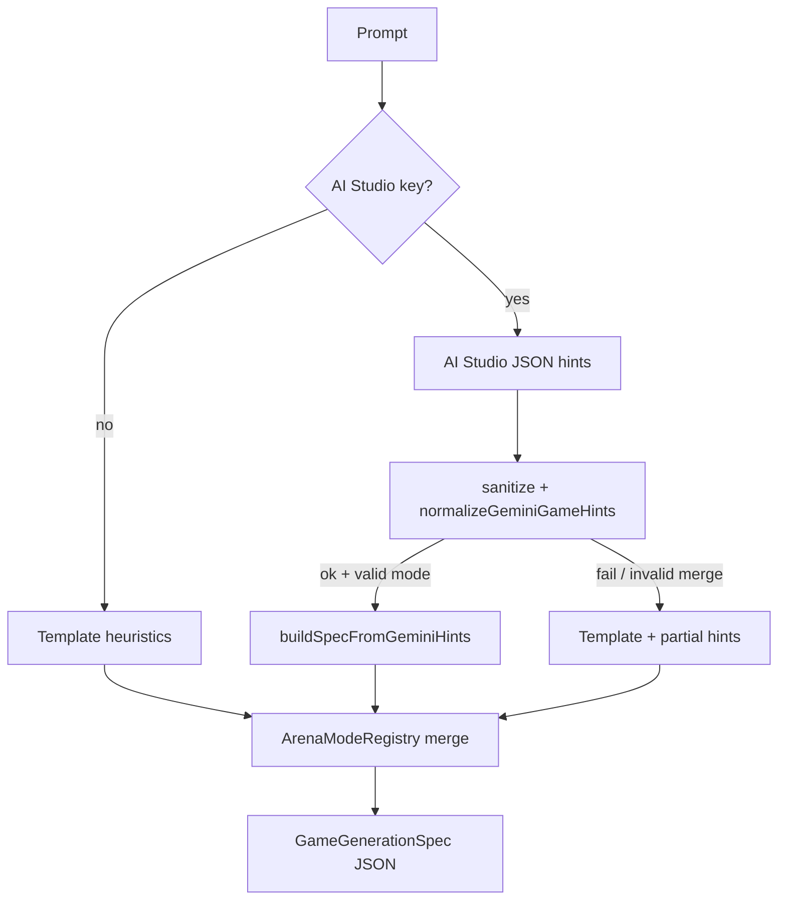
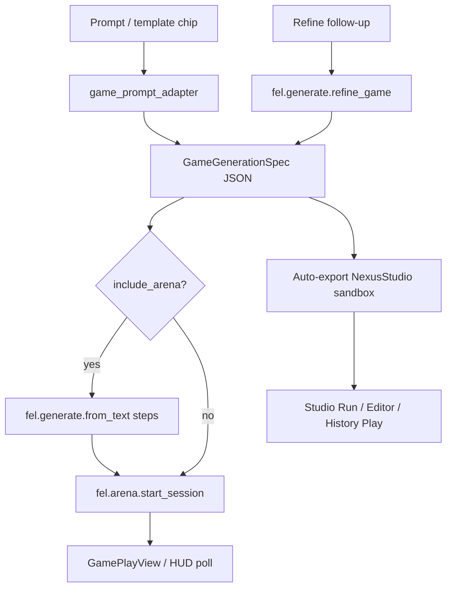

# NEXUS Game Generator

Natural language → **playable game spec** (mode, venue, rules, HUD theme) with optional arena voxel steps and one-tap session bootstrap. Honest **PREVIEW** tier — template + optional **Google AI Studio** (Gemini REST) assist, not full Seele AI asset synthesis.

**Firebase is not required for generation** — AI Studio uses a direct `generativelanguage.googleapis.com` API key from the Xcode scheme, shell env, Keychain, or exported AI Studio JSON in Downloads.

## Comparison vs Seele AI

| Capability | Seele AI (target) | NEXUS Game Generator (this pass) |
|------------|-------------------|----------------------------------|
| Prompt → game spec | LLM + registry wiring | **Template MVP** (18 modes) + optional **AI Studio** (`NEXUS_AI_STUDIO_API_KEY`) → `ArenaModeRegistry` |
| Prompt → arena mesh | Full 3D asset pipeline (UE `.uasset`, animations) | Reuses `fel.generate.from_text` voxel/mesh jobs when `include_arena` |
| Iterative refine | Conversational follow-ups | **`fel.generate.refine_game`** — harder/easier/mode swaps across all playable modes |
| Preview + play | In-editor play | **GamePlayView** via `NexusGameplayEngine` session start + history **Play** |
| Generator UI | Dedicated creator shell | **`NexusGameGeneratorView`** — 18 template chips + **Powered by AI Studio** badge when live |
| Agent / Cursor | Autonomous asset PRs | **`generate_game`** MCP + in-app tool chip |
| Export / share | Branch + registry PR | **Auto-export** to NexusStudio sandbox JSON (`generated_games/*.json`) on generate/refine |

### Honest gaps (PREVIEW)

- AI Studio assists **mode/difficulty/arena intent only** — registry still owns venue, rules envelope, mesh paths.
- No new modes/venues created — maps to existing 18 production modes in `ArenaModeRegistry` (`market_browse` excluded).
- No MetaHuman / Seele mesh retargeting — procedural mesh jobs remain `fel.generate.create_model` stubs.
- MCP `generate_game` on Cursor host uses headless `nexus_agent_cli`; iOS uses live bridge.
- Metal renderer / SceneKit dunk remain preview-tier per `NEXUS_DELIVERY_MATRIX.md`.

## Adapter tiers

| Tier | Trigger | `metadata.ai_provider` | `metadata.adapter` | Behavior |
|------|---------|------------------------|-------------------|----------|
| **Template** | No API key / `force_template` | `template_mvp` | `template_mvp` | Keyword heuristics in `game_prompt_adapter.cpp` (18 playable modes) |
| **AI Studio** | Key present + REST success | `ai_studio` | `ai_studio_assisted` | AI Studio JSON hints → registry merge via `buildSpecFromGeminiHints` |
| **AI Studio fallback** | Key present but REST/merge fails | `template_mvp` | `template_mvp` | Template path + partial hint merge (`template_ai_studio_partial`); `ai_studio_fallback_reason` in metadata |

Set `params.force_template: true` on `fel.generate.game` to skip AI Studio even when a key is configured (CI / deterministic repro).

### Google AI Studio setup (no Firebase)

1. Open [Google AI Studio](https://aistudio.google.com/) → **Get API key** (Gemini API).
2. **iOS / Simulator:** FinalEvolutionLab Xcode scheme → Run → Arguments → Environment Variables:
   - `NEXUS_AI_STUDIO_API_KEY` = your key (preferred)
   - Optional: `NEXUS_AI_STUDIO_MODEL` = e.g. `gemini-2.0-flash`
3. **Cursor / headless:** `export NEXUS_AI_STUDIO_API_KEY=...` before `nexus_agent_cli` or gameplay tests that hit live AI Studio (optional).
4. **Keychain (device):** scheme env keys are persisted to Keychain on first launch via `NexusAIStudioBootstrap` — subsequent runs work without scheme vars.
5. **Downloads JSON:** export AI Studio config JSON to `~/Downloads` (or set `NEXUS_AI_STUDIO_CONFIG_PATH`) — keys are resolved via env references, never written to the repo.

### Environment

| Variable | Purpose |
|----------|---------|
| `NEXUS_AI_STUDIO_API_KEY` | **Primary** Google AI Studio / Gemini API key |
| `NEXUS_AI_STUDIO_MODEL` | Model override (default `gemini-2.0-flash`) |
| `NEXUS_AI_STUDIO_CONFIG_PATH` | Optional directory for exported AI Studio JSON |
| `NEXUS_AGENT_GEMINI_KEY` | Legacy alias (still supported) |
| `GEMINI_API_KEY` | Fallback alias (Firebase AI Logic compat) |
| `FEL_LLM_KEY` | Legacy alias |
| `NEXUS_AGENT_GEMINI_MODEL` | Legacy model alias |

Swift: `Config.hasNexusAiStudioKey`, `Config.nexusAiStudioModel`, `NexusAIStudioBootstrap.isConfigured`. C++: `NexusAIStudioConfig::resolve()`.

## LLM-free resilient path (offline / CI / App Store)

When no API key is available, the generator remains fully usable:

1. **Template keyword cascade** — `inferModeIdFromPrompt` in `game_prompt_adapter.cpp` (18 production modes; `market_browse` excluded).
2. **UI template chips** — `NexusGameGeneratorTemplates` + `NexusGameGeneratorView` pre-fill proven prompts; **Template-only** badge when offline.
3. **Registry as source of truth** — venue, mesh path, input scheme, duration always from `ArenaModeRegistry` (never invented by LLM).
4. **Refinement without LLM** — `fel.generate.refine_game` re-infers mode from combined original + follow-up text.
5. **Deterministic spec IDs** — `slugifySpecId` + timestamp suffix for sandbox export.
6. **Hybrid safety** — even with AI Studio: markdown fence strip, alias normalization, invalid `mode_id` → template + partial hint merge with logged reason.
7. **Arena optional** — `include_arena` gates `fel.generate.from_text`; spec + session work without mesh jobs.
8. **Export/play continuity** — auto-export on generate/refine; `GameModeRegistry.playableMode(forRegistryId:)` resolves aliases; history rows include **Play**.



## Flow



## Playable modes (18)

| Mode id | Template title | Keyword family |
|---------|----------------|----------------|
| `basketball_h2h` | Head to Head | pickup, 1v1, h2h |
| `basketball_dunk` | Dunk Contest | dunk, slam, hoops |
| `basketball_3v3` | 3v3 Streetball | 3v3, streetball |
| `karate_h2h` | Karate 1v1 | dojo, kata, karate |
| `karate_endless` | Karate Endless | endless wave |
| `baseball` | Home Run Derby | home run, baseball |
| `football` | Kick Return | gridiron, kick return |
| `soccer` | Penalty Shootout | penalty, soccer |
| `golf` | Closest to Pin | golf, links, fairway |
| `tennis` | Rally Ace | tennis, rally |
| `volleyball` | Sand Rally | sand court, volleyball |
| `gymnastics` | Floor Routine | gymnastics, floor |
| `surfing` | Surf Break | surf, surfing |
| `skateboarding` | Skate Park | skateboard, ollie |
| `snowboarding` | Mountain Slope | snowboard, halfpipe |
| `brain_brawl` | Brain Brawl | trivia, brain brawl |
| `who_scene_it` | Who Scene It | film quiz, scene it |
| `court_carnival` | Court Carnival | carnival, trick shot |

Aliases: `venice_pickup` → `basketball_h2h`, `karate_kata` → `karate_endless`. Non-game `market_browse` is rejected.

## Commands

| Surface | Command / query | Handler |
|---------|-----------------|---------|
| Agent JSON | `fel.generate.game` | `GameplayApplication::applyGameGenerationCommand` |
| Agent JSON | `fel.generate.refine_game` | Same (uses last spec or `params.spec`) |
| Agent JSON | `fel.generate.parse_game` | `GameplayApplication::applyGameGenerationQuery` |
| Arena text | `fel.generate.from_text` | Unchanged — arena-only voxel/mesh (see `NEXUS_TEXT_TO_GENERATION.md`) |
| iOS UI | Arena hub **Create** tab | `NexusGameGeneratorView` |
| MCP / Agent | `generate_game` | Registry + `nexus_agent_cli` / iOS bridge (`force_template` supported) |

### Example: generate

```json
{
  "type": "command",
  "id": "gen_001",
  "payload": {
    "command": "fel.generate.game",
    "params": {
      "text": "Hard basketball dunk contest on Venice beach court",
      "include_arena": true,
      "start_session": true,
      "force_template": false
    }
  }
}
```

### Example: refine

```json
{
  "type": "command",
  "id": "gen_refine",
  "payload": {
    "command": "fel.generate.refine_game",
    "params": {
      "text": "make it harder and switch to penalty shootout"
    }
  }
}
```

### Example: parse only

```json
{
  "type": "query",
  "id": "parse_game",
  "payload": {
    "query": "fel.generate.parse_game",
    "text": "Karate endless wave dojo challenge"
  }
}
```

## Game spec envelope

```json
{
  "spec_id": "game_hard_basketball_dunk_12345",
  "mode_id": "basketball_dunk",
  "display_name": "Dunk Contest",
  "venue_token": "Venice_Beach_Court",
  "rules": {
    "difficulty_tier": "hard",
    "mode_weight": 1.25,
    "match_duration_seconds": 300,
    "scoring_enabled": true,
    "input_scheme": "charge"
  },
  "hud_theme": {
    "primary_color": "#FF6B00",
    "accent_color": "#00D4FF",
    "badge_label": "HOOPS",
    "preview_label": "PREVIEW · GENERATED GAME SPEC"
  },
  "metadata": {
    "adapter": "ai_studio_assisted",
    "ai_provider": "ai_studio",
    "generator_tier": "ai_studio_assisted",
    "ai_studio_model": "gemini-2.0-flash",
    "fallback_used": false
  },
  "export_path_hint": "NexusStudio/sandbox/generated_games/game_hard_basketball_dunk_12345.json"
}
```

## Implementation map

| File | Role |
|------|------|
| `engine/ai_interface/src/nexus_ai_studio_config.cpp` | AI Studio env + Downloads JSON resolution |
| `engine/ai_interface/src/gemini_game_prompt_client.cpp` | AI Studio REST + fence strip + `normalizeGeminiGameHints` |
| `app/gameplay/src/game_prompt_adapter.cpp` | 18-mode template heuristics, merge, fallback orchestration |
| `app/gameplay/src/gameplay_application.cpp` | `fel.generate.game` / `refine_game` / `parse_game` |
| `FinalEvolutionLab/Services/NexusAIStudioBootstrap.swift` | iOS key resolution (env + Keychain, no Firebase) |
| `FinalEvolutionLab/Models/NexusGameGeneratorTemplates.swift` | Canonical prompts for all 18 playable modes |
| `FinalEvolutionLab/Services/NexusGameplayEngine.swift` | iOS bridge commands + sandbox export |
| `FinalEvolutionLab/Views/NexusGameGeneratorView.swift` | Create-tab UI, AI Studio badge, auto-export, play/history |

## Tests

```bash
# C++ gameplay unit tests (includes game generator + AI Studio stub)
cmake --build build-headless --target nexus_gameplay_test
./build-headless/nexus_gameplay_test

# Swift logic tests (templates + playable resolver)
xcodebuild test -scheme FinalEvolutionLab -destination 'platform=iOS Simulator,name=iPhone 16' \
  -only-testing:FinalEvolutionLabTests/GameLogicTests/gameGeneratorTemplatesMapToRegisteredModes

# Full gate
./scripts/nexus_build_gate.sh
```

C++ coverage:

- `game_prompt_adapter_maps_dunk_contest_prompt`
- `game_prompt_adapter_covers_all_playable_modes` (18 canonical prompts)
- `game_prompt_adapter_builds_spec_from_gemini_hints`
- `game_prompt_adapter_rejects_invalid_gemini_mode_id`
- `game_prompt_adapter_normalizes_mode_aliases`
- `game_prompt_adapter_sanitize_llm_json_strips_markdown_fence`
- `game_prompt_adapter_gemini_partial_fallback_keeps_hints`
- `game_prompt_adapter_refine_swaps_to_soccer_from_follow_up`
- `game_prompt_adapter_force_template_skips_gemini`
- `gemini_game_prompt_client_stub_transport_returns_hints`
- `gameplay_generate_game_produces_spec_and_session`
- `gameplay_refine_game_harder_adjusts_difficulty`

Swift coverage:

- `gameGeneratorTemplatesMapToRegisteredModes` (18 templates)
- `gameGeneratorPlayableModeResolverHandlesAliases`
- `gameGeneratorReadinessMapsDifficulty`
- `generatedGameSpecParsesAdapterMetadata`

## Related docs

- `docs/NEXUS_TEXT_TO_GENERATION.md` — arena voxel / mesh pipeline
- `docs/NEXUS_SCAN_TO_GENERATION.md` — pose/scan → arena
- `docs/NEXUS_AGENT_TOOLS.md` — `generate_game` tool + Gemini planner
- `docs/NEXUS_STUDIO_IDE.md` — Studio Run / Editor from exported specs
- `SEELE_AI_EXECUTION_PACKAGE.md` — archived UE/Seele reference (not NEXUS retail ship)
