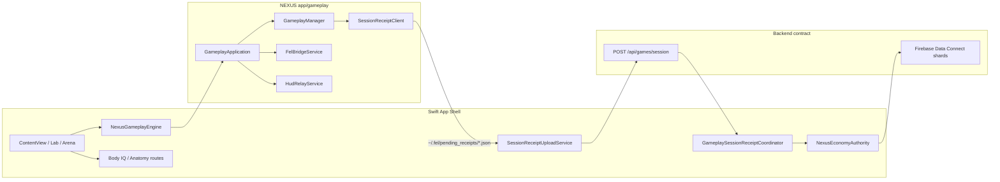

# NEXUS Product Integration — Economy · Education · Realtime

**Repo:** `/Users/elijahbonds/Final-Evolution-Lab`  
**Scope:** NEXUS as the **sole product surface** — C++ gameplay + Swift app shell. Unreal Engine is **not** in this integration path.

**Audit date:** 2026-06-19

---

## Architecture (NEXUS-only)



---

## 1. Gameplay session receipts

| Layer | Responsibility |
|-------|----------------|
| **C++** `GameplayManager::onMatchEnd` | Builds FEL-compatible receipt JSON (`sessionReceiptBody`) and enqueues flush |
| **C++** `SessionReceiptClient` | Persists to `~/.fel/pending_receipts/{session_id}.json`; optional curl POST when `base_url` / `NEXUS_RECEIPT_URL` set |
| **Swift** `NexusGameplayEngine.stop` | `fel.arena.end_session` → `fel.arena.flush_receipts` → triggers upload |
| **Swift** `SessionReceiptUploadService` | Normalizes disk JSON → `POST Config.gameplaySessionReceiptURL` with Firebase Bearer |
| **Swift** `GameplaySessionReceiptCoordinator` | Ingests 2xx response as `server_verified`; dedupes by receipt id |

**Endpoint:** `Config.gameplaySessionReceiptURL` → `https://api.finalevolutiongroup.com/api/games/session` (override: `FEL_SESSION_RECEIPT_URL` or `FEL_API_BASE_URL`).

**Mock / CI tests:**

- C++: `session_receipt_body_matches_api_contract`, `flagship_modes_emit_post_ready_receipts` in `tests/unit/gameplay/gameplay_test.cpp`
- Python: `backend/tests_phase1/test_session_receipt_upload.py` (FastAPI TestClient, no live network)

**Honest status:** Disk queue + centralized `NexusBackendClient.postSessionReceipt` wired. **PREVIEW lane** (`--preview-firebase`, placeholder plist): queue-only, no POST, no ranked economy grants. **Live lane:** POST when `FirebaseBootstrap.isConfigured && !isPreviewMode`; production 2xx proof still required (V-012 partial).

---

## 2. Education (Swift shell)

| Route | Entry | Label |
|-------|-------|-------|
| Body IQ Lab | `LabView` → `BodyIQEducationLabView` | `PREVIEW · NEXUS EDUCATION` |
| Drawing-in module | NavigationLink inside Body IQ | In-module copy only |
| Bio-Digital anatomy | `BioDigitalAnatomyView` | `PREVIEW · SCENEKIT STUB` |
| Train tab shortcut | `TrainingHubView.educationPreviewCard` | `PREVIEW` badge |

**Services:** `AnatomyEducationService` (HTTP lesson/eligibility API when configured).

**Honest posture:** Education surfaces are **preview** — SceneKit anatomy stub, not UE `FELEducationEngine`. Certification copy is aspirational until backend lesson completion is server-verified.

---

## 3. Economy — fail-closed IAP + server-authoritative shards/PRQ

### IAP (Intra-Abdominal Pressure — breath metrics)

- **Not** App Store IAP in this layer.
- C++ `ThreadSafeFitnessData` + `fel.fitness.update` reject non-finite and out-of-range samples (**fail-closed**).
- Swift `NexusEconomyAuthority.acceptsIAPSample` mirrors the same gate for future HealthKit bridges.

### Shards & PRQ

| Trust level | Ranked PRQ | Shard credits |
|-------------|------------|---------------|
| `localPractice` | DEBUG practice only for non-NEXUS modes | Never applied in Release |
| `sessionBound` | History only | Pending queue only |
| `serverVerified` | Applied via `LabViewModel.ingestVerifiedGameplayReceipt` | `pendingUnverifiedShardCredits` until SQL ledger |

**NEXUS P0/P1 modes** (`basketball_dunk`, `karate_endless`): `NexusEconomyAuthority.usesServerAuthoritativeEconomy` — local `finalizeResults()` does **not** grant shards/PRQ; grants arrive only from `POST /api/games/session` 2xx.

**SQL authority:** See `infra/ECONOMY_AUTHORITY_CONTRACT.md` — `SpendEvolutionShards` for spends; `AppendShardLedger` admin path for arena grants.

---

## 4. Flagship gameplay depth (app/gameplay)

| Mode | Venue | Integration tests |
|------|-------|-------------------|
| **Dunk contest** | `Venice_Beach_Court` | `flagship_basketball_dunk_validate_only_integration`, dunk lifecycle receipt |
| **Karate endless** | `Zen_Dojo` | `flagship_karate_kata_validate_only_integration`, wave/strike/HUD |
| **Venice pickup (H2H proxy)** | `Venice_Beach_Court` | `flagship_venice_pickup_validate_only_integration`, throw-catch + venue travel |

Additional: `court_carnival` validate-only integration; 19-mode `ArenaModeRegistry`.

---

## 5. Realtime (NEXUS app layer)

| Channel | Swift | C++ | Status |
|---------|-------|-----|--------|
| Vault / venue bridge | `FELRealtimeClient` (optional) | `FelBridgeService` + WebSocket stub | Stub connects; production URL via `FEL_GAME_WS_URL` |
| HUD relay | `FELHUDRelayClient` | `HudRelayService` | `fel.hud.poll` local; WS via `FEL_HUD_WS_URL` |
| Motion / streaming | `StreamingPortalView`, `RealtimeMotionTrackerView` | — | Preview labels; not ship-critical |

---

## 6. Verification commands

```bash
# Headless C++ tests (from repo root)
cmake -S . -B build-headless -DNEXUS_ENABLE_RENDERER=OFF
cmake --build build-headless
cd build-headless && ctest --output-on-failure

# Backend session receipt mock
cd backend && python -m pytest tests_phase1/test_session_receipt_upload.py -q

# iOS Swift compile (simulator)
xcodebuild -scheme FinalEvolutionLab -destination 'platform=iOS Simulator,name=iPhone 16' build CODE_SIGNING_ALLOWED=NO
```

---

## 7. Integration status summary

| Area | Status |
|------|--------|
| Session receipt disk queue | **Done** |
| Swift POST `/api/games/session` | **Done** (auth-gated) |
| C++ optional curl POST | **Done** (URL-configured) |
| Economy server authority (NEXUS modes) | **Done** (`NexusEconomyAuthority`) |
| Education routes + preview labels | **Done** |
| Dunk / karate / venice flagship tests | **Done** (+ receipt chain test) |
| Realtime production WS | **Partial** (stubs + env URLs) |
| TestFlight / retail ship | **Out of scope** (NEXUS embed track) |

**Related docs:** `NEXUS_DELIVERY_MATRIX.md`, `infra/ECONOMY_AUTHORITY_CONTRACT.md`, `docs/NEXUS_GAMEPLAY_UX_BAR.md`
