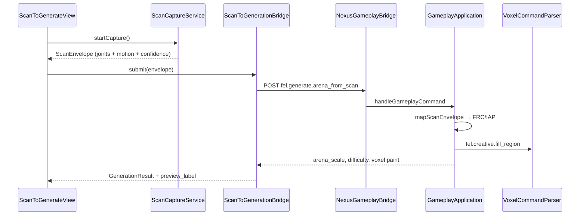

# NEXUS Scan-to-Generation

Scan (body pose / motion / camera) → personalized NEXUS arena content. This pipeline replaces Unreal MetaHuman mesh retargeting with **fitness-proportional** voxel generation and honest preview labeling.

## Flow



## Scan envelope schema

POST body (also accepted nested as `params.envelope`):

```json
{
  "schema_version": 1,
  "scan_id": "uuid",
  "source": "arkit_pose | vision_camera | coremotion | simulated",
  "captured_at_epoch_ms": 1700000000000,
  "confidence01": 0.72,
  "joints": {
    "left_knee_angle_deg": 98,
    "right_knee_angle_deg": 102,
    "left_shoulder_reach01": 0.74,
    "right_shoulder_reach01": 0.71,
    "hip_stability01": 0.88
  },
  "motion": {
    "vertical_estimate_inches": 28.5,
    "flight_time_seconds": 0.58,
    "peak_accel_g": 1.35
  },
  "frc_proxies": {
    "mobility01": 0.72,
    "active_range01": 0.68,
    "control01": 0.81
  }
}
```

`frc_proxies` is optional — when omitted, C++ derives FRC from joint angles and reach.

## Agent commands

| Command | Role |
|---------|------|
| `fel.generate.arena_from_scan` | Composite: maps envelope → fitness + generative params + voxel fill |
| `fel.fitness.update` | Applied internally (mobility, active range, control, IAP) |
| `fel.creative.fill_region` | Arena floor paint at origin ± `paint_radius` |

### Example request

```json
{
  "command": "fel.generate.arena_from_scan",
  "id": "scan_001",
  "params": { "...scan envelope..." }
}
```

### Example response

```json
{
  "status": "ok",
  "payload": {
    "fitness": { "frc_composite": 0.73, "power_readiness": 0.68 },
    "generative": {
      "arena_scale": 1.05,
      "difficulty_tier": 2,
      "recommended_mode_id": "basketball_dunk",
      "voxel_material": 7,
      "paint_radius": 6
    },
    "commands_applied": [
      "fel.fitness.update",
      "fel.creative.fill_region",
      "fel.generate.arena_from_scan"
    ],
    "preview_label": "GENERATED FROM SCAN · NOT METAHUMAN MESH"
  }
}
```

## Swift surfaces

| File | Purpose |
|------|---------|
| `ScanCaptureService.swift` | ARKit body / Vision pose / CoreMotion capture |
| `ScanEnvelope.swift` | Envelope model + test mapper |
| `ScanToGenerationBridge.swift` | POST to NEXUS bridge |
| `ScanToGenerateView.swift` | Dashboard sheet with `FELPreviewLabel` |
| `DashboardView.swift` | “Scan to Generate” entry card |

## C++ surfaces

| File | Purpose |
|------|---------|
| `scan_envelope_mapper.h/.cpp` | Envelope → fitness + generative params + command JSON |
| `gameplay_application.cpp` | `fel.generate.arena_from_scan` handler |

## Tests (no camera in CI)

```bash
cd ~/Final-Evolution-Lab
cmake -S . -B build-headless -DNEXUS_ENABLE_RENDERER=OFF
cmake --build build-headless --target nexus_scan_envelope_test
./build-headless/nexus_scan_envelope_test
```

Swift unit tests (`GameLogicTests`): `scanEnvelopeCommandPlanIncludesFitnessAndFillRegion`, `simulatedScanEnvelopeIsDeterministicShape`.

## Device requirements

| Capability | Requirement |
|------------|-------------|
| **Simulator / CI** | Simulated pose envelope; no camera permission |
| **Vision camera path** | Front camera + `NSCameraUsageDescription`; iOS 17+ |
| **ARKit body path** | `ARBodyTrackingConfiguration.isSupported` (A12+ devices with rear/depth stack; falls back to Vision) |
| **CoreMotion fallback** | Accelerometer; used when pose joints unavailable |
| **NEXUS bridge** | Linked `nexus_gameplay` static library in app target |

## Honest preview labeling

- Simulator and `-UITestMode`: **PREVIEW · SIMULATED POSE / NO LIVE MESH**
- Live Vision/ARKit: source tagged; confidence shown; competitive PRQ **not** committed from this flow
- Response `preview_label`: **GENERATED FROM SCAN · NOT METAHUMAN MESH**

## vs Unreal MetaHuman

MetaHuman pipeline targets film-quality facial/body mesh retargeting. NEXUS scan-to-generation targets **athlete OS** inputs (joint angles, reach, FRC proxies, motion peaks) that drive **gameplay difficulty and voxel arena** — faster, on-device, and aligned with `ThreadSafeFitnessData` / throw-catch physics.
