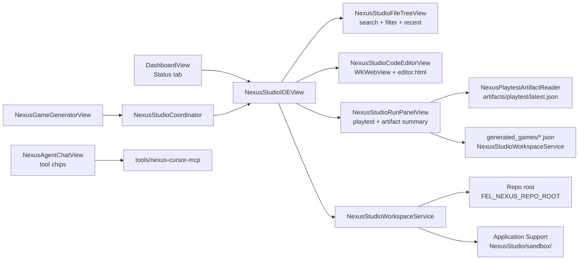
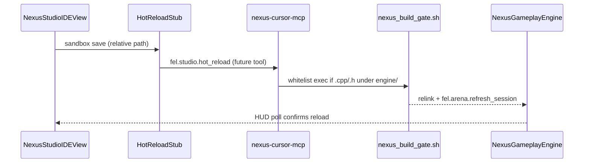

# NEXUS Studio IDE

Embedded in-app code browser and lightweight editor for the NEXUS monorepo. Ships inside **FinalEvolutionLab** (iOS) as **NEXUS Studio** — a preview surface labeled honestly until full IDE parity with Unreal Editor is reached.

**Version:** v0.3 (this pass)

## Goals

- Browse `engine/`, `FinalEvolutionLab/`, `app/gameplay/`, and `assets/` from the iOS app
- Safe **read-only** default; optional **sandbox edit** (never writes to the live repo)
- **Search/filter** file tree, **recent files**, engine vs Swift root chips
- **Run panel** — one-tap in-app playtest for sprint modes **and exported Game Generator specs**
- **Game Generator bridge** — `Open in Studio Run` auto-exports spec JSON and pre-selects mode + readiness
- Honest **PREVIEW** badges via `FELPreviewLabel`
- Pairs with **Cursor MCP** (`studio_open_file`, `studio_run_playtest`, `list_artifacts`)

## Architecture



### Layers

| Layer | File(s) | Role |
|-------|---------|------|
| Models | `Models/NexusStudioModels.swift` | Roots, filters, panels, languages |
| Workspace | `Services/NexusStudioWorkspaceService.swift` | Index tree, search, recent files, sandbox I/O |
| Playtest read | `Services/NexusPlaytestArtifactReader.swift` | Summarize macOS playtest JSON |
| Coordinator | `Services/NexusStudioCoordinator.swift` | Cross-surface Studio launch (Run / Editor) |
| Hot-reload stub | `Services/NexusStudioHotReloadStub.swift` | PREVIEW notification on sandbox save |
| UI shell | `Views/NexusStudio/NexusStudioIDEView.swift` | Split view, Editor/Run panels, save confirm |
| File tree | `Views/NexusStudio/NexusStudioFileTreeView.swift` | Filter chips, search, recent, recursive tree |
| Run panel | `Views/NexusStudio/NexusStudioRunPanelView.swift` | Sprint mode picker, **generated spec playtest**, artifact card |
| Editor | `Views/NexusStudio/NexusStudioCodeEditorView.swift` | WKWebView bridge (base64 content) |
| Web asset | `Resources/NexusStudio/editor.html` | Monospace textarea + language badge |
| Agent chips | `Views/NexusAgentChatView.swift` | Whitelisted one-tap tools |
| Entry | `Views/DashboardView.swift` | **OPEN NEXUS STUDIO** card |

### Repo root resolution (priority)

1. `FEL_NEXUS_REPO_ROOT` environment variable (Xcode scheme or launch arg)
2. DEBUG default: `~/Final-Evolution-Lab` or `/Users/elijahbonds/Final-Evolution-Lab`
3. Bundled `NexusStudioSnapshot/` resource (future release path — not yet generated)

### Sandbox writes

Edits in **Sandbox edit** mode require **confirmation** before writing to:

```
Application Support/NexusStudio/sandbox/<relative-path>
```

Loads prefer sandbox copy when present. The live checkout under `FEL_NEXUS_REPO_ROOT` is never modified.

## User flow

1. Open app → **Status** tab (`DashboardView`)
2. Scroll to **NEXUS STUDIO** card (badge: `PREVIEW · IDE v0.3`)
3. Tap **OPEN NEXUS STUDIO** → full-screen `NexusStudioIDEView` (or **Open Studio Run panel** shortcut)
4. Use **All / Engine / Swift / Gameplay / Assets** filter chips; search files
5. Open from **RECENT** or expand tree roots (`engine`, `FinalEvolutionLab`, …)
6. **Editor** panel: read/edit with language badge (C++/Swift/JSON/Markdown)
7. Switch to **Sandbox edit** → edit → **Save to sandbox** (confirmation dialog; fires hot-reload stub notification)
8. **Run** panel: pick a **generated game spec** from sandbox or a sprint mode → **PLAYTEST**; refresh macOS artifact summary
9. **Game Generator** (Arena Create tab or Dashboard): generate → **Open in Studio Run** exports JSON and opens Run panel pre-loaded
10. **Agent** tab: tap whitelisted tool chips (List Modes, Dunk Playtest, …)
11. Toolbar `</>` → **Open repo in Cursor** or **Open file in Cursor**

### Cursor / MCP parity

| In-app | MCP / CLI |
|--------|-----------|
| Open file in Cursor | `studio_open_file` / `open_ide_file` |
| Run panel playtest | `playtest` / `studio_run_playtest` (macOS script) |
| Generated spec playtest | In-app only (sandbox `generated_games/*.json`) |
| Artifact summary card | `list_artifacts`, `read_state` |
| — | `fel.studio.list_artifacts` via `nexus_agent_cli` |

See `docs/NEXUS_CURSOR_BRIDGE.md` and `docs/CURSOR_NEXUS_CONTROL.md`.

## Build verification

```bash
cd ~/Final-Evolution-Lab
xcodebuild -scheme FinalEvolutionLab -destination 'platform=iOS Simulator,name=iPhone 16' build
cd tools/nexus-cursor-mcp && npm run build
```

## Remaining gaps vs Unreal Editor

| Unreal Editor capability | NEXUS Studio v0.2 |
|------------------------|-------------------|
| 3D viewport / level design | ❌ Not in scope — use NEXUS Metal renderer + game scenes |
| Blueprint visual scripting | ❌ C++/Swift source only |
| Asset import pipeline | ❌ JSON mesh manifests browsable; no FBX import UI |
| Live hot-reload into running game | ⚠️ **Stub only** — `NexusStudioHotReloadStub` posts `NEXUSStudioSandboxSaved`; no CMake regen yet |
| IntelliSense / LSP | ❌ Plain textarea; language badge only (no CodeMirror grammar) |
| Multi-file tabs | ❌ Single file; search + recent files help navigation (roadmap below) |
| Debugger / breakpoints | ❌ |
| Source control (Git) | ❌ |
| Console + log stream | ⚠️ Run panel shows playtest artifact; no live engine console |
| Build / cook / deploy | ❌ External scripts + MCP `build_gate` only |
| Content browser (uassets) | ❌ NEXUS uses `assets/nexus/*.nexusmesh.json` |
| Collaborative editing | ❌ |

### Planned upgrades (post v0.3)

1. Bundle `NexusStudioSnapshot` at build time for TestFlight (no Mac path)
2. Full **CodeMirror 6** bundle with cpp/swift/json grammars
3. **Hot-reload hook** (stub → production) — see below
4. **Multi-tab editor** — see roadmap below
5. **Diff view** sandbox vs repo
6. Optional **Mac Catalyst** pane with full repo write + `nexus_build_gate.sh` trigger

### Hot-reload stub (v0.3 — PREVIEW)

**Problem:** Sandbox edits do not reach the running NEXUS engine or CMake build graph.

**Stub (shipped):**

| Piece | Role |
|-------|------|
| `NexusStudioHotReloadStub.notifySandboxSave(relativePath:)` | Posts `Notification.Name.nexusStudioSandboxSaved` with `relative_path` |
| `NexusStudioIDEView.saveCurrentFile()` | Calls stub after atomic sandbox write |
| `NexusStudioHotReloadStub.statusLine(for:)` | Human-readable PREVIEW footer text |

**Production path (not wired):**



**Acceptance for v1 hot-reload:**

- Sandbox save under `engine/` or `app/gameplay/` triggers incremental gate (Mac host only)
- iOS device shows toast + Run panel artifact refresh; no silent failure
- Failed regen rolls back to last known-good dylib / static link

### Multi-tab editor roadmap

**Target:** Unreal-style tab strip without full IDE scope creep.

| Phase | Deliverable | Notes |
|-------|-------------|-------|
| **M1** | `NexusStudioOpenTab` model + tab bar UI | Max 8 tabs; pin active tab in `UserDefaults` |
| **M2** | Dirty-state per tab + close confirmation | Unsaved dot matches single-file UX today |
| **M3** | Split editor (optional) | Read-only diff pane sandbox vs repo |
| **M4** | Tab restore on Studio reopen | Serialize tab paths + cursor offset |
| **M5** | MCP `studio_open_file` opens tab remotely | Cursor agent adds tab; iOS polls coordinator |

**Non-goals:** Git branch tabs, LSP per tab, collaborative cursors.

Unreal Editor remains the reference for **world authoring** and **Blueprint iteration**; NEXUS Studio targets **source truth** for the C++/Swift/JSON stack that actually ships.
