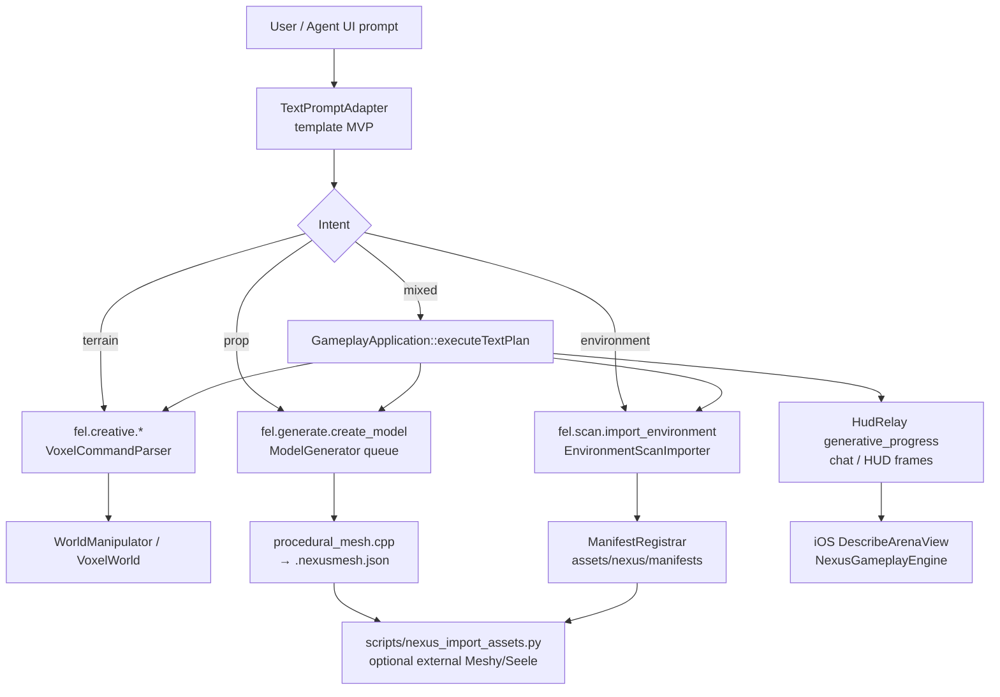

# NEXUS Text-to-Generation Pipeline

Natural language prompts flow through a **template-based adapter** (no LLM API key required) into existing NEXUS agent commands: `fel.creative.*` voxel edits, `fel.generate.create_model` mesh jobs, and `fel.scan.*` environment imports.

## Flow diagram



## Entry points

| Surface | Command / query | Handler |
|---------|-----------------|---------|
| Agent JSON | `fel.generate.from_text` | `GameplayApplication::applyTextGenerationCommand` |
| Agent JSON | `fel.creative.from_text` | Same (creative-only steps) |
| Agent JSON | `fel.generate.parse_prompt` | `GameplayApplication::applyTextGenerationQuery` |
| iOS UI | Arena hub → **Create** tab | `DescribeArenaView` → `NexusGameplayEngine.describeArena` |
| Runtime | `CommandRouter` + `AgentServer` | Routes `from_text` / `parse_prompt` to gameplay handler |

## Adapter (`engine/ai_interface`)

`parseTextPrompt()` maps keywords to a `TextGenerationPlan`:

- **Terrain:** raise / lower / flatten / paint → `fel.creative.*` with clamped radius & material heuristics (sand=7, grass=2, court=5, …).
- **Props:** hoop, cone, bench, marker → `fel.generate.create_model` with slugified `asset_id`.
- **Environment:** arena / court / scan / luma / arkit → `fel.scan.import_environment` with fixture paths.
- **Fallback:** unrecognized text → single procedural `create_model` job.

Metadata on every plan includes `import_pipeline: scripts/nexus_import_assets.py` for external mesh registration.

## Execution

1. `CommandRouter` sends `fel.generate.from_text` and `fel.creative.from_text` to the gameplay handler (not directly to `GenerativePipeline`).
2. `GameplayApplication::executeTextPlan` runs each step:
   - Creative → `VoxelCommandParser::apply_command`
   - Generate / scan → `GenerativePipeline::handleCommand`
3. Progress broadcasts on HUD channel `generative_progress` (`executing` → `complete` / `failed`).
4. Response payload includes `step_results`, `jobs`, `intent`, `agent_summary`, and `preview_label`.

## Example prompts

| Prompt | Planned steps (summary) |
|--------|-------------------------|
| `Small sand mound at center with a training cone prop` | `raise_terrain` (sand) + `create_model` (cone) |
| `Flatten court floor and add orange hoop prop` | `flatten_terrain` + `create_model` (hoop) |
| `Raise a large grass hill at north with a bench prop` | `raise_terrain` (z=-6) + `create_model` (bench) |
| `Paint sand court and import luma beach venue scan` | `flatten_terrain` / `paint` + `import_environment` (luma fixture) |
| `Describe a beach court with sand dune and orange hoops` | mixed terrain + prop (+ optional venue scan) |

## Agent JSON examples

**Execute full plan:**

```json
{
  "type": "command",
  "id": "arena_001",
  "payload": {
    "command": "fel.generate.from_text",
    "params": {
      "text": "Beach court with sand dune center and orange basketball hoops"
    }
  }
}
```

**Preview plan only:**

```json
{
  "type": "query",
  "id": "arena_preview",
  "payload": {
    "query": "fel.generate.parse_prompt",
    "text": "Flatten hardwood court with training cones"
  }
}
```

## Tests

- `tests/unit/generative/generative_test.cpp` — `text_prompt_adapter_builds_template_plan_without_llm`
- `tests/unit/gameplay/gameplay_test.cpp` — adapter mapping, `from_text` execution, router integration

Run the full gate:

```bash
./scripts/nexus_build_gate.sh
```

## Related docs

- `docs/gameplay_logic/04_Creative_Mode_Protocol.md` — `fel.creative.*` reference
- `docs/architecture/NEXUS_Generative_Pipeline.md` — mesh / scan pipeline
- `docs/architecture/AgentInterface.md` — agent routing table
- `scripts/nexus_import_assets.py` — external asset import & manifest merge
