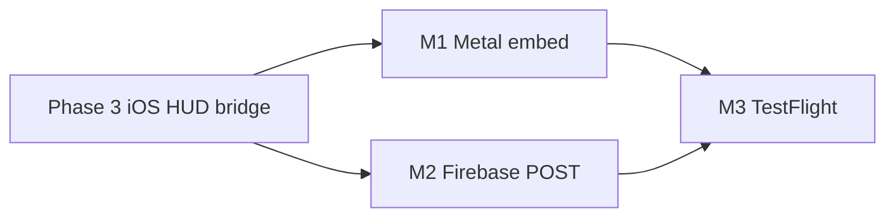

# FEL NEXUS v1.1 — Metal, Firebase, TestFlight

> Kickoff after spec v1 Phase 3 integration gate (DoD **4/9**). Closes remaining §9.1 device/backend gates.

## Milestones

### M1 — Metal venue embed (iOS)

**Goal:** Replace SceneKit-only P0 preview with NEXUS renderer on `CAMetalLayer` / `MTKView`.

| Task | Owner | Files |
|------|-------|-------|
| Metal backend stub | `2c499563` | `engine/renderer/src/metal_renderer.mm`, `metal_renderer.h` |
| iOS host view | `b783814d` | `FinalEvolutionLab/Views/GameSceneHostView.swift`, bridge headers |
| Mobile mesh routing | `f7eb525d` + `2c499563` | `assets/nexus/manifests/nexus_asset_manifest.json` (`mobile_mesh` keys), `asset_manifest.cpp` |
| Venice ≤80k tris on device | `f7eb525d` | `*_mobile.nexusmesh.json` siblings (14/14) |

**Exit criteria:** Dunk Contest venue visible via Metal on iPhone simulator; DoD **#1**, **#2** partial (visual + mesh profile).

**Verify:**
```bash
./scripts/build-nexus-ios.sh
cd FinalEvolutionLab && xcodebuild -scheme FinalEvolutionLab \
  -destination 'platform=iOS Simulator,name=iPhone 16' build
```

---

### M2 — Firebase session receipt POST

**Goal:** End-to-end session receipt from C++ queue → backend `/api/games/session`.

| Task | Owner | Files |
|------|-------|-------|
| Desktop live POST | `fd7a0191` | `app/gameplay/src/session_receipt_client.cpp` (curl + retry) |
| iOS drain + auth | `b783814d` | `GameplaySessionReceiptCoordinator.swift`, `Config.swift` |
| Bridge queue path | `61458eb4` | `NexusGameplayBridge.mm` (document `~/.fel/pending_receipts/`) |

**Exit criteria:** Receipt JSON POST returns **200**; file removed from pending queue; DoD **#4** met.

**Verify:**
```bash
./scripts/smoke_v1.sh --skip-build   # dunk win → queue
# Manual: confirm POST + queue drain (see IOS_RUNBOOK.md)
```

---

### M3 — TestFlight archive checklist

**Goal:** Signed Release archive uploadable to App Store Connect.

| Step | Action |
|------|--------|
| 1 | `./scripts/build-nexus-ios.sh` (Release static libs) |
| 2 | Xcode → **Product → Archive** (scheme `FinalEvolutionLab`, team **7KJ6G7HLL4**) |
| 3 | Validate: Dunk + Karate flows on physical device (touch → score → receipt) |
| 4 | **Organizer → Distribute App → TestFlight** |
| 5 | Internal testers: verify HUD, no crash on session end, receipt sync |

**Exit criteria:** Build appears in App Store Connect; internal TestFlight install succeeds; DoD **#9** met.

**Reference:** `FinalEvolutionLab/IOS_RUNBOOK.md` §Archive / TestFlight.

---

## Dependencies



## Out of scope (v1.2+)

- HUD WebSocket relay (`/ws/hud`) — local `fel.hud.frame` JSON sufficient for v1.1
- Jolt Physics, GLB runtime loader, 17 P2 mode sims
- HealthKit → PRQ live pipeline
