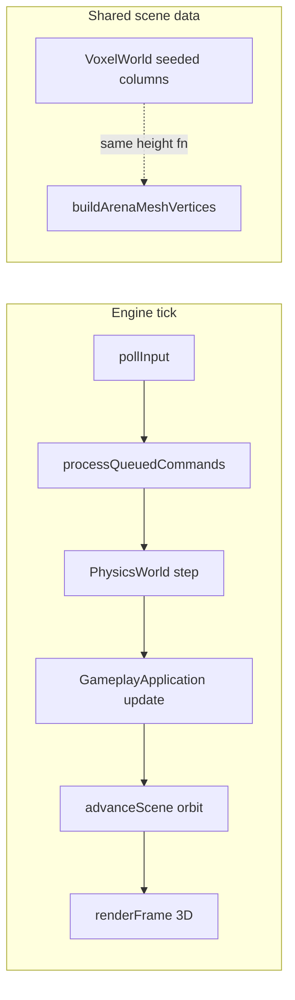

# NEXUS 3D Milestone (M1)

> **Decision:** Ship first visible 3D gameplay on the **NEXUS macOS dev runtime** (Path A). UE embed (Path B) and iOS hybrid bridge (Path C) remain documented follow-ups.

## What shipped

| Layer | Change |
|-------|--------|
| **Scene** | `arena_scene.cpp` — procedural training floor + 5×5 cube field with height variation |
| **Camera** | Orbit perspective camera; `advanceScene(delta)` called from `Engine::tick` before `renderFrame` |
| **Renderer** | `VulkanRenderer` now uses depth buffer, MVP uniform, 3D vertex format (`vec3` position + color) |
| **Shaders** | `arena.vert` / `arena.frag` (SPIR-V embedded via `scripts/compile_nexus_shaders.sh`) |
| **Gameplay loop** | `runtime/main.cpp` seeds `VoxelWorld` columns to match rendered cubes; agent TCP still on `:9090` |
| **MoltenVK** | Unchanged — `SDL_Vulkan_LoadLibrary(nullptr)` uses linked loader (no duplicate MoltenVK dylib) |

## How to see 3D

```bash
# Dependencies (macOS)
brew install sdl3 molten-vk vulkan-loader shaderc

# Build
cmake -S . -B build-full -DNEXUS_ENABLE_RENDERER=ON
cmake --build build-full --target nexus_runtime

# Run — SDL window with orbiting cube arena
./build-full/nexus_runtime
```

**Expected:** dark navy background, large floor slab, cyan/blue cube pillars in a grid, camera slowly orbiting the center. Close window or ⌘Q to exit.

**Agent bridge:** while running, `fel.creative.*` / `fel.fitness.*` JSON commands still work on stdin or TCP `localhost:9090`.

## Architecture



### Why NEXUS first (not UE embed this session)

- Vulkan renderer + gameplay loop already wired; smallest diff to **visible** 3D.
- UE embed requires shipping `UnrealFramework` (~GB) and Xcode link steps — better as M2 once NEXUS proves loop timing.
- iOS SceneKit views remain product UI; NEXUS is the emulator-scale native runtime per `SystemSpecs.md`.

## Revision plan (engine + game)

### M2 — Scene ↔ gameplay sync
- Drive cube mesh from live `VoxelWorld` dirty chunks (not static procedural mesh).
- Expose `fel.query.get_scene_snapshot` with camera pose + chunk diff.

### M3 — Input + physics coupling
- SDL camera controls (orbit/zoom); ray pick → `fel.creative.set_voxel`.
- Jolt or custom rigid bodies for throw-catch props in the arena.

### M4 — UE embed on device
- Drop `UnrealFramework` per `FinalEvolutionLab/EmbeddedFrameworks/README.md`.
- `UnrealManager` placeholder → live embed; `GamePlayView` prefers UE when framework present.

### M5 — Hybrid iOS bridge
- `GamePlayView` detects NEXUS (Mac TCP) vs UE vs SceneKit fallback.
- Forward `fel.*` JSON to Mac agent when NEXUS transport reachable.

### M6 — Production renderer
- Indexed meshes, instancing, PBR materials, VMA allocator, validation-friendly pipeline cache.

## Files touched

```
engine/renderer/include/nexus/renderer/arena_scene.h
engine/renderer/src/arena_scene.cpp
engine/renderer/shaders/arena.{vert,frag}
engine/renderer/include/nexus/renderer/arena_shader_spv.h
engine/renderer/src/vulkan_renderer.cpp
engine/core/src/engine.cpp
runtime/src/main.cpp
scripts/compile_nexus_shaders.sh
CMakeLists.txt
```

## Shader rebuild

After editing GLSL:

```bash
./scripts/compile_nexus_shaders.sh
```
