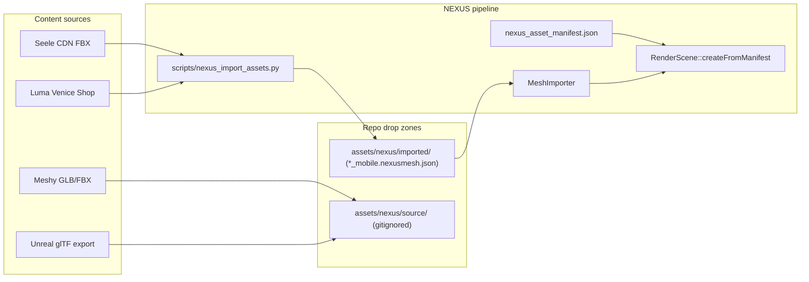

# NEXUS Asset Pipeline

Maps FEL content sources (Seele, Luma, Meshy, Unreal/AntiGravity) to NEXUS import paths, mobile LOD meshes, procedural fallbacks, and UE export steps.

## Inventory summary (2026-06-19)

| Category | Count | Notes |
|----------|-------|-------|
| **Seele environment FBX (CDN)** | **13** | Downloaded to `assets/nexus/source/` (gitignored) |
| **Mobile `.nexusmesh.json` venues** | **13** | Real geometry via assimp + trimesh + pyfqmr decimation |
| **Demo marker** | **1** | `demo_venue_marker.nexusmesh.json` (pyramid) |
| **Venue registry** | **16** | `nexus_asset_manifest.json` venues section (15 gameplay + 1 shop) |
| **Production modes @ mobile** | **18** | `./scripts/nexus_validate_production_modes.sh` |

All v1 environment meshes are **real conversions** (not pyramid stubs). Mobile LOD files are ≤50k verts / ≤80k tris per spec (Zen Dojo ≤40k/60k).

## Architecture



## Mobile LOD strategy

Per FEL NEXUS spec §4.8 / §6.3:

| Stage | Vertex budget | Tri budget | Notes |
|-------|---------------|------------|-------|
| **Default venues** | ≤ 50,000 | ≤ 80,000 | iPhone 12 target |
| **Zen Dojo** | ≤ 40,000 | ≤ 60,000 | Smaller interior |
| **LOD1 (future)** | 25,000 | 40,000 | Distance culling |

**Pipeline:** FBX/GLB → assimp CLI → trimesh → pyfqmr quadric decimation → `{asset_id}_mobile.nexusmesh.json`

**Git policy:** Only `*_mobile.nexusmesh.json` files are committed (~4–8 MB each). Desktop/full meshes are optional (`--write-desktop`, `--write-full`) and gitignored.

### Runtime mesh selection

`AssetManifest::resolveMeshPath()` picks the mesh file:

| Env var | Profile | Mesh loaded |
|---------|---------|-------------|
| *(default)* | `mobile` | `imported_mesh_mobile` |
| `NEXUS_MESH_PROFILE=mobile` | mobile | `imported_mesh_mobile` |
| `NEXUS_MESH_PROFILE=desktop` | desktop | `imported_mesh_desktop` → `imported_mesh` |
| `NEXUS_MESH_LOD=full` | full | `imported_mesh_full` (if present) |
| `NEXUS_USE_MOBILE_MESH=0` | desktop | legacy alias for full/desktop |

iOS builds should leave env unset (mobile default). Desktop dev can set `NEXUS_MESH_PROFILE=desktop` when `--write-desktop` meshes exist locally.

## Manifest schema

- **Schema:** `assets/nexus/manifests/nexus_asset_manifest.schema.json`
- **Live manifest:** `assets/nexus/manifests/nexus_asset_manifest.json`

Key asset fields:

| Field | Description |
|-------|-------------|
| `imported_mesh` | Runtime default path (mobile LOD filename) |
| `imported_mesh_mobile` | Mobile decimated mesh under `import_root` |
| `imported_mesh_desktop` | Optional full-res desktop mesh (local only) |
| `imported_mesh_full` | Optional copy under `imported/full/` |
| `vertex_count` / `tri_count` | Mobile LOD stats |
| `source_vertex_count` / `source_tri_count` | Pre-decimation stats |
| `mobile_decimated` | `true` if pyfqmr decimation ran |

## NEXUS mesh interchange (`.nexusmesh.json`)

```json
{
  "format": "nexusmesh",
  "version": "1",
  "name": "venice_beach_court_model_fbx",
  "lod": "mobile",
  "conversion_method": "assimp-cli+trimesh+decimate",
  "vertex_count": 40076,
  "tri_count": 80000,
  "vertices": [{ "position": [x,y,z], "color": [r,g,b] }],
  "indices": [0, 1, 2, ...]
}
```

Consumed by `MeshImporter::importNexusMeshJson` → `nexus::renderer::Mesh`.

## Import commands

**Prerequisites:**

```bash
brew install assimp
pip3 install trimesh pyfqmr
# Optional (Python 3.10+): pip3 install fast_simplification
```

**Full venue re-import (recommended):**

```bash
# Download Seele CDN FBX → assets/nexus/source/
python3 scripts/nexus_import_assets.py --download

# Convert all venues → mobile LOD + update manifest
python3 scripts/nexus_import_assets.py --convert --update-manifest

# Single venue
python3 scripts/nexus_import_assets.py --convert --update-manifest \
  --asset venice_beach_court_model_fbx

# Optional: also write desktop/full (large, gitignored)
python3 scripts/nexus_import_assets.py --convert --write-desktop --write-full --update-manifest
```

**Flags:**

| Flag | Purpose |
|------|---------|
| `--mobile-lod` / `--no-mobile-lod` | Decimate to iOS budget (default: on) |
| `--max-verts 50000` | Override vertex cap |
| `--max-tris 80000` | Override triangle cap |
| `--update-manifest` | Write paths + tri counts to manifest |
| `--allow-stub` | Pyramid fallback on failure (avoid in CI) |

## Converted venues (v1)

| Asset ID | Mobile verts | Mobile tris | Decimated |
|----------|-------------|-------------|-----------|
| `venice_beach_court_model_fbx` | 40,076 | 80,000 | yes |
| `zen_dojo_environment_model_fbx` | 38,251 | 39,584 | no (under budget) |
| `baseball_park_environment_model_fbx` | 37,370 | 74,109 | yes |
| `gridiron_stadium_environment_model_fbx` | 39,958 | 79,890 | yes |
| `soccer_stadium_environment_model_fbx` | 28,184 | 39,858 | no |
| `golf_course_environment_model_fbx` | 37,465 | 74,380 | yes |
| `tennis_court_environment_model_fbx` | 34,733 | 64,117 | yes |
| `volleyball_sand_court_environment_model_fbx` | 37,351 | 75,013 | yes |
| `skate_park_environment_model_fbx` | 37,258 | 71,849 | yes |
| `mountain_slope_environment_model_fbx` | 24,866 | 40,000 | no |
| `gymnastics_floor_environment_model_fbx` | 44,014 | 79,754 | yes |
| `neuro_arena_environment_model_fbx` | 36,747 | 73,486 | yes |
| `luma_venice_shop_environment_model_fbx` | 36,637 | 73,285 | yes |

## C++ import surface

| Header | Role |
|--------|------|
| `engine/assets/include/nexus/assets/asset_manifest.h` | Load manifest, `resolveMeshPath()` |
| `engine/assets/include/nexus/assets/mesh_importer.h` | `.nexusmesh.json` loader |
| `engine/renderer/include/nexus/renderer/scene.h` | `createFromManifest` |

`RenderScene::createFromManifest` loads the environment mesh via `manifest.resolveMeshPath()` (mobile by default) and overlays it on the procedural arena fallback.

## Engine runtime contract (primary + backdrop)

### Resolution chain

| Step | Component | Behavior |
|------|-----------|----------|
| 1 | Xcode **Bundle NEXUS venue assets** | Copies `nexus_asset_manifest.json` + all `imported/*.nexusmesh.json` → `MyApp.app/assets/nexus/` |
| 2 | iOS launch | `NexusMetalBridge` sets `NEXUS_RESOURCE_ROOT=<bundle>/` and `NEXUS_MESH_PROFILE=mobile` |
| 3 | Manifest lookup | `AssetManifest::findVenueForMode(modeId)` → `environment_asset_id` + optional `backdrop_asset_id` |
| 4 | Mesh path | `resolveMeshPathAtDistance(asset, 0)` → `import_root/{id}_mobile.nexusmesh.json` when sidecar exists |
| 5 | C++ scene | `RenderScene::createFromManifest` imports primary mesh, then `attachVenueBackdrop` for `backdrop_asset_id` (Venice + surf) |
| 6 | Metal draw | `MetalRenderer::loadVenueFromManifest` uploads full scene (court + Luma shop when configured) |
| 7 | SceneKit fallback | `NexusBundledMeshLoader` resolves the same paths via bridge API; hybrid overlay skips atmospheric nodes (Metal owns venue) |

### Bridge API (Swift ↔ C++)

| Function | Purpose |
|----------|---------|
| `nexus_metal_bridge_bundled_venue_mesh_loadable(modeId)` | Hybrid Metal gate — scene has ≥1 drawable mesh for mode |
| `nexus_metal_bridge_bundled_mesh_loadable(assetId)` | Direct asset check (e.g. `luma_venice_shop_environment_model_fbx`) |
| `nexus_metal_bridge_resolve_bundled_mesh_path(assetId, buf, len)` | Absolute mobile mesh path under bundle resource root |

### Venice composite

Venues `venice_beach_court` and `venice_beach_surf` set `backdrop_asset_id: luma_venice_shop_environment_model_fbx`. Metal renders court + decimated Luma shop behind court bounds (~130k tri budget). SceneKit-only paths load the same Luma sidecar via `NexusBundledMeshLoader` before procedural silhouettes.

### Headless validation

```bash
NEXUS_MESH_PROFILE=mobile ./scripts/nexus_validate_production_modes.sh   # 18/18 production modes
NEXUS_MESH_PROFILE=mobile NEXUS_RESOURCE_ROOT=$PWD ./build-full/nexus_runtime --validate-only --mode market_browse
NEXUS_MESH_PROFILE=mobile NEXUS_RESOURCE_ROOT=$PWD ./build-full/nexus_runtime --validate-only --mode basketball_dunk  # 2 meshes (court + Luma)
ctest --test-dir build-full -R renderer_test  # scene_from_manifest_loads_venice_beach
```

## Procedural fallbacks

When mesh import fails:

| `fallback` | Visual |
|------------|--------|
| `arena_grid` | Floor + cube columns (M1 default) |
| `flat_plane` | Floor only |
| `none` | Empty scene |

## Unreal → NEXUS export

1. UE 5.7 glTF export → `assets/nexus/source/{venue_key}.glb`
2. Run the glTF import path below (or `--convert` if the asset is already in the manifest with a `source_url`)
3. Verify `imported_mesh_mobile` in manifest and re-run `./scripts/nexus_validate_production_modes.sh`

## glTF / GLB import

NEXUS converts `.gltf` / `.glb` through the same assimp → trimesh → pyfqmr pipeline as FBX. Use this for UE exports, Meshy drops, or any local glTF without a manifest `source_url`.

**Prerequisites:** same as [Import commands](#import-commands) (`assimp`, `trimesh`, `pyfqmr`).

**One-off convert (no manifest update):**

```bash
python3 scripts/nexus_import_assets.py \
  --from-gltf assets/nexus/source/venice_beach_surf.glb \
  --mobile \
  --output assets/nexus/imported/venice_beach_surf_environment_model_fbx_mobile.nexusmesh.json
```

**Convert + register in manifest:**

```bash
# 1. Drop source under gitignored source root
cp ~/Exports/VeniceSurf.glb assets/nexus/source/venice_beach_surf_environment_model_fbx.glb

# 2. Add asset entry + venue environment_asset_id in nexus_asset_manifest.json (or use --asset with existing id)
python3 scripts/nexus_import_assets.py \
  --convert --update-manifest \
  --asset venice_beach_surf_environment_model_fbx

# 3. Gate
NEXUS_MESH_PROFILE=mobile ./scripts/nexus_validate_production_modes.sh
```

**Flags specific to glTF:**

| Flag | Purpose |
|------|---------|
| `--from-gltf PATH` | Convert a local `.gltf` or `.glb` without loading manifest first |
| `--output PATH` | Destination `.nexusmesh.json` (default: `imported/<stem>.nexusmesh.json`) |
| `--mobile` | Emit `*_mobile.nexusmesh.json` with decimation + auto `--update-manifest` when paired with `--convert` |

**Notes:**

- glTF with external `.bin` textures: keep sibling files next to the `.gltf`; assimp resolves relative paths from the source directory.
- Draco-compressed glTF: requires assimp built with Draco support (`brew install assimp` on macOS includes it).
- After import, the Xcode **Bundle NEXUS venue assets** run script copies all `imported/*.nexusmesh.json` into the app — no pbxproj edit per mesh.

## Related docs

- [NEXUS_3D_Milestone.md](./NEXUS_3D_Milestone.md)
- FEL NEXUS spec §6 Asset & Content Pipeline
