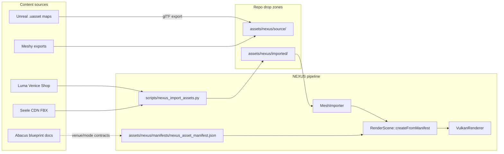

# NEXUS Asset Pipeline

Maps every FEL content source (Seele, Luma, Meshy, Unreal/AntiGravity, Abacus) to NEXUS import paths, procedural fallbacks, and UE export steps.

## Inventory summary (repo scan)

| Category | In repo | Notes |
|----------|---------|-------|
| **FBX / GLB / glTF mesh files** | **0** | No binary meshes in git; Seele descriptors point to CDN URLs |
| **Unreal `.uasset` / `.umap`** | **0** | UE content lives in local Mac UE project / cooked builds, not this monorepo |
| **Seele asset descriptors** | **48** | `seeles_work/assets/models/*/*.json` — environments, characters, props |
| **Seele environment FBX URLs** | **17** | tripo3D / hunyuan3D / mixamo on `seelemedia.s3.us-east-1.amazonaws.com` |
| **Luma venue references** | **2** | `Luma_Venice_Shop` — shop environment (tripo3D via Seele); iOS ARKit/Luma pose stub in Swift |
| **Meshy** | **0 direct** | No Meshy exports or API keys in repo; use same drop path as Seele FBX |
| **Abacus** | **docs only** | Architecture blueprint referenced in `docs/design_reference/` and `seeles_work/` — not a mesh source |
| **Unreal package paths** | **14 venues** | `UnrealStarter/BasketballGame/Content/FEL/Config/ArenaSettings.json` |
| **Venue registry** | **yes** | `backend/FEL_VenueRegistry.production.json` (19 modes → venue keys) |
| **NEXUS procedural arena** | **yes** | `RenderScene::createProceduralArena` — cube grid + floor (M1 milestone) |
| **NEXUS imported demo mesh** | **1** | `assets/nexus/imported/demo_venue_marker.nexusmesh.json` (pyramid marker) |

### Seele environment assets (CDN — need download)

| Asset ID | FEL venue | Generator | Source tag |
|----------|-----------|-----------|------------|
| `venice_beach_court_model_fbx` | Venice_Beach_Court | tripo3D | seele |
| `zen_dojo_environment_model_fbx` | Zen_Dojo | mixamo | seele |
| `baseball_park_environment_model_fbx` | Baseball_Park | mixamo | seele |
| `gridiron_stadium_environment_model_fbx` | Gridiron_Stadium | mixamo | seele |
| `soccer_stadium_environment_model_fbx` | Soccer_Stadium | mixamo | seele |
| `golf_course_environment_model_fbx` | Links_Golf_Course | mixamo | seele |
| `tennis_court_environment_model_fbx` | Tennis_Court | mixamo | seele |
| `volleyball_sand_court_environment_model_fbx` | Sand_Court | mixamo | seele |
| `skate_park_environment_model_fbx` | Skate_Park | hunyuan3D | seele |
| `mountain_slope_environment_model_fbx` | Mountain_Slope | mixamo | seele |
| `gymnastics_floor_environment_model_fbx` | Training_Floor | mixamo | seele |
| `neuro_arena_environment_model_fbx` | Neuro_Arena | mixamo | seele |
| `luma_venice_shop_environment_model_fbx` | Luma_Venice_Shop | tripo3D | **luma** |
| `training_floor_environment_model_fbx` | Training_Floor | mixamo | seele |

Descriptor path pattern: `seeles_work/assets/models/{id}/{id}.json`

### Unreal-only content (export required)

No cooked meshes in git. Maps referenced in `ArenaSettings.json` and `UnrealIntegration/Config/`:

| Mode | UE open level package |
|------|----------------------|
| basketball_* / court_carnival / surfing | `/Game/FEL/Venues/VeniceBeach/VeniceBeach` |
| karate_* | `/Game/FEL/Venues/Dojo/Dojo` |
| baseball | `/Game/FEL/Venues/BaseballPark/BaseballPark` |
| football | `/Game/FEL/Venues/GridironStadium/GridironStadium` |
| soccer | `/Game/FEL/Venues/SoccerStadium/SoccerStadium` |
| golf | `/Game/FEL/Venues/GolfCourse/GolfCourse` |
| tennis | `/Game/FEL/Venues/TennisCourt/TennisCourt` |
| volleyball | `/Game/FEL/Venues/SandCourt/SandCourt` |
| skateboarding | `/Game/FEL/Venues/SkatePark/SkatePark` |
| snowboarding | `/Game/FEL/Venues/MountainSlope/MountainSlope` |
| gymnastics | `/Game/FEL/Venues/TrainingFloor/TrainingFloor` |
| brain_brawl / who_scene_it | `/Game/FEL/Venues/NeuroArena/NeuroArena` |
| market_browse | `/Game/FEL/Venues/Luma_Venice_Shop/Luma_Venice_Shop` |

## Architecture



## Manifest schema

- **Schema file:** `assets/nexus/manifests/nexus_asset_manifest.schema.json`
- **Live manifest:** `assets/nexus/manifests/nexus_asset_manifest.json`

Each **asset** record:

| Field | Description |
|-------|-------------|
| `id` | Stable asset id |
| `source` | `meshy` \| `luma` \| `unreal` \| `seele` \| `procedural` |
| `kind` | `environment` \| `character` \| `prop` \| `marker` |
| `source_url` | CDN or export URL |
| `source_descriptor` | Path to Seele JSON descriptor in repo |
| `unreal_package` | UE content path for parity |
| `imported_mesh` | Relative path under `import_root` |
| `fallback` | `arena_grid` \| `flat_plane` \| `none` |
| `generation_method` | tripo3D, hunyuan3D, meshy, mixamo, … |

Each **venue** record links `mode_ids` → `environment_asset_id` + `unreal_open_level`.

## NEXUS mesh interchange (`.nexusmesh.json`)

Native CPU mesh format consumed by `MeshImporter::importNexusMeshJson`:

```json
{
  "format": "nexusmesh",
  "version": "1",
  "vertices": [{ "position": [x,y,z], "color": [r,g,b] }],
  "indices": [0, 1, 2, ...]
}
```

Matches `nexus::renderer::Mesh` (vec3 position + vec3 color, indexed triangles).

## Import commands

```bash
# Inspect manifest
python3 scripts/nexus_import_assets.py

# Download all Seele source_url FBX to assets/nexus/source/
python3 scripts/nexus_import_assets.py --download

# Stub convert downloaded FBX → .nexusmesh.json (replace with Blender/assimp later)
python3 scripts/nexus_import_assets.py --convert

# Single asset
python3 scripts/nexus_import_assets.py --download --convert --asset venice_beach_court_model_fbx
```

Shell stub: `scripts/nexus_convert_mesh.sh`

### C++ import surface

| Header | Role |
|--------|------|
| `engine/assets/include/nexus/assets/asset_manifest.h` | Load JSON manifest |
| `engine/assets/include/nexus/assets/mesh_importer.h` | `.nexusmesh.json` (full), glTF/FBX (stubs) |
| `engine/renderer/include/nexus/renderer/scene.h` | `createFromManifest`, `createProceduralArena` |

`VulkanRenderer::init` calls `RenderScene::createFromManifest("assets/nexus/manifests/nexus_asset_manifest.json")`.

## Procedural fallbacks

When `imported_mesh` is missing or import fails:

| `fallback` | Visual |
|------------|--------|
| `arena_grid` | Floor plane + 5×5 varying-height cube columns (default M1 arena) |
| `flat_plane` | Floor only |
| `none` | Empty scene (camera only) |

Venice Beach (`basketball_h2h` default) also loads `demo_venue_marker.nexusmesh.json` when present — orange pyramid at arena center proving import path.

## Unreal Engine → glTF for NEXUS

When only `.uasset` exists on the Mac UE project:

### Option A — UE glTF Exporter (recommended)

1. Open `UnrealStarter/BasketballGame` or Mac `MyProject.uproject` in UE 5.7.
2. Install **glTF Exporter** plugin (Epic) if not enabled.
3. Content Browser → select venue map or static mesh folder under `/Game/FEL/Venues/...`
4. **Asset Actions → Export** → glTF 2.0 (.gltf + .bin) or single `.glb`.
5. Copy export to `assets/nexus/source/{venue_key}.glb`.
6. Run `python3 scripts/nexus_import_assets.py --convert` (or manual Blender → `.nexusmesh.json`).
7. Set `imported_mesh` in manifest for that venue's `environment_asset_id`.

### Option B — Datasmith / FBX round-trip

1. UE: **File → Export Selected** (FBX) for venue static meshes.
2. Place FBX in `assets/nexus/source/`.
3. Blender headless (future): FBX → decimate → `.nexusmesh.json`.
4. Update manifest `imported_mesh` and optional `source: unreal`.

### Option C — Cooked content (shipping)

iOS/desktop cooked payloads remain UE-native; NEXUS dev runtime uses manifest + interchange meshes only.

## Meshy & Luma drop workflow

### Meshy

1. Export from Meshy as **GLB** or **FBX** (Y-up, meters).
2. Drop into `assets/nexus/source/meshy_{venue_key}.glb`.
3. Add or update manifest asset with `source: meshy`, `source_url` if hosted.
4. Convert: `python3 scripts/nexus_import_assets.py --convert --asset {id}`.
5. Set `imported_mesh` on the venue's environment asset.

### Luma (Venice Shop + future Luma captures)

1. Luma web export → GLB, or use Seele `luma_venice_shop_environment_model_fbx` CDN URL.
2. Drop GLB/FBX to `assets/nexus/source/luma_venice_shop.glb`.
3. Manifest entry `luma_venice_shop_environment_model_fbx` already maps `market_browse` → `vault_shop`.
4. Download existing: `python3 scripts/nexus_import_assets.py --download --asset luma_venice_shop_environment_model_fbx`

## Abacus alignment

Abacus blueprint (external GitHub) defines mode contracts, PRQ, and venue registry semantics. This pipeline does **not** duplicate Abacus rules — it consumes:

- `backend/FEL_VenueRegistry.production.json` — mode ↔ venue keys
- `ArenaSettings.json` — UE package paths
- Seele layout specs in `infra/fel_environment_layouts/` — spawn/camera coordinates (future NEXUS placement)

## CMake targets

| Target | Contents |
|--------|----------|
| `nexus_assets` | `asset_manifest.cpp` |
| `nexus_renderer` | `mesh_importer.cpp`, scene, Vulkan |

## Next steps

1. **Download Seele environments:** `python3 scripts/nexus_import_assets.py --download --convert`
2. **Drop Meshy/Luma GLB** into `assets/nexus/source/` and wire `imported_mesh` in manifest.
3. **Export UE venues** to glTF on Mac per section above.
4. **Replace stub converter** with Blender/assimp in `scripts/nexus_import_assets.py`.
5. **M2:** Drive full environment mesh from manifest per mode (replace procedural grid for shipping preview).

## Related docs

- [NEXUS_3D_Milestone.md](./NEXUS_3D_Milestone.md) — M1 procedural arena
- [SystemSpecs.md](./SystemSpecs.md) — NEXUS vs UE vs iOS split
- `seeles_work/seele_checklist_validation_report.md` — Seele venue checklist
