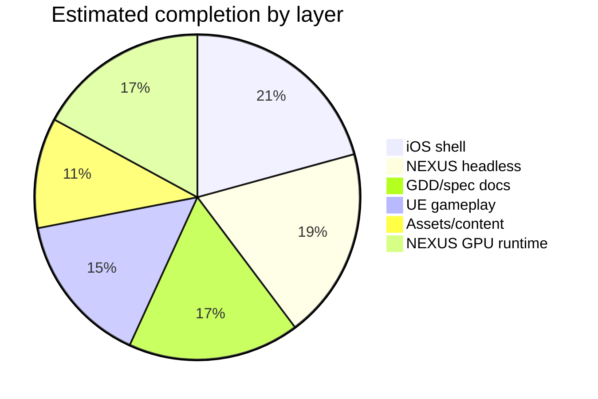

# Final Evolution Lab — Game Completion Audit

**Date:** 2026-06-19  
**Branch:** `anti-gravity-fel`  
**Scope:** iOS shell, NEXUS engine, app/gameplay layer, UE/backend registries, GDD/asset handoffs

---

## Executive summary

| Dimension | Estimate | Verdict |
|-----------|----------|---------|
| **Overall product completion** | **~65%** | Beta-ready iOS gameplay shell; NEXUS GPU runtime stable; UE venues + full asset import remain |
| iOS Arena shell (19 modes) | ~85% | All modes routable; SceneKit + NEXUS bridge wired; receipt path in DEBUG |
| NEXUS headless engine | ~78% | 3/3 unit tests pass; generative + asset pipeline coherent |
| NEXUS GPU runtime | ~70% | `nexus_runtime` launches (MoltenVK loader fix); loads Venice Beach mesh (65k verts) |
| UE 5.7 gameplay | ~62% | 14 production C++ modes; 5 registry stubs |
| Content / assets | ~45% | 13 Seele FBX sources in git; Venice Beach real nexusmesh; 12 venue stubs |
| GDD / spec coverage | ~70% | Protocol docs restored; venue sheets in design_reference |

**Build status (this pass):**

```text
ctest --test-dir build-headless     → 3/3 PASS (protocol, gameplay, generative)
./build-full/nexus_runtime          → launches, loads venice_beach_court_model_fbx.nexusmesh.json
xcodebuild FinalEvolutionLab (sim)  → BUILD SUCCEEDED (NexusGameplayBridge linked)
```

Prior audit: [READINESS_AUDIT_2026-06-19.md](./READINESS_AUDIT_2026-06-19.md)

---

## Mode matrix (19 iOS game modes)

| # | Mode ID | iOS registry | Input scheme | Backend status | UE C++ | SceneKit / shell | GDD venue |
|---|---------|--------------|--------------|----------------|--------|------------------|-----------|
| 1 | `basketball_h2h` | production | charge | production | yes | strong 3D | Venice Beach |
| 2 | `basketball_dunk` | production | charge | production | yes | black viewport risk | Venice Beach |
| 3 | `basketball_3v3` | production | charge | production | yes | chrome | Venice Beach |
| 4 | `karate_h2h` | production | charge | production | yes | chrome | Zen Dojo |
| 5 | `karate_endless` | preview | charge | production | yes | chrome | Zen Dojo |
| 6 | `baseball` | production | swipe | production | yes | chrome | Baseball Park |
| 7 | `football` | production | kickReturn | production | yes | chrome | Gridiron |
| 8 | `soccer` | production | penaltyKick | production | yes | black viewport risk | Soccer Stadium |
| 9 | `golf` | production | swipeGolf | production | yes | chrome | Links Course |
| 10 | `tennis` | production | rallyAce | production | yes | chrome | Tennis Court |
| 11 | `volleyball` | production | rallyAce | production | yes | chrome | Sand Court |
| 12 | `gymnastics` | production | rhythmTap | staging | yes | academy overlay | Training Floor |
| 13 | `surfing` | preview | rhythmTap | production | yes | preview | Venice Surf |
| 14 | `skateboarding` | preview | rhythmTap | staging | stub | strong 3D | Skate Park |
| 15 | `snowboarding` | preview | rhythmTap | staging | stub | chrome | Mountain Slope |
| 16 | `brain_brawl` | production | rhythmTap | staging | yes | academy | Neuro Arena |
| 17 | `who_scene_it` | preview | filmQuiz | preview | stub | film quiz UX | Neuro Arena |
| 18 | `court_carnival` | preview | partyBoard | preview | stub | strong 3D | Venice Beach |
| 19 | `market_browse` | preview | dragTap | non-game-module | N/A | module browser | Luma Venice Shop |

**Registry gap:** Backend `FEL_ModeManager.production.json` also defines `movement_lab` (education, non-scoring) — **not** in iOS `GameModeId` (intentional: 19 game modes + 1 education module = 20 backend entries).

**Swift fix applied:** `whoSceneIt` duplicate `inputScheme` switch case removed (was unreachable; now correctly returns `.filmQuiz`).

---

## Asset status

| Source | In repo | Imported to NEXUS | In UE cooked build |
|--------|---------|-------------------|-------------------|
| Seele environment FBX (17 CDN URLs) | **13 FBX in `assets/nexus/source/`** | **1 real mesh** (Venice Beach, 65k verts); 12 pyramid stubs | export required |
| Luma Venice Shop | 2 refs | stub adapter | map path defined |
| Meshy | 0 | drop zone documented | — |
| NEXUS procedural arena | yes | `RenderScene::createProceduralArena` | — |
| NEXUS imported meshes | 14 `.nexusmesh.json` | Venice Beach real; others stub until `--convert` | — |
| UE `.uasset` / cooked iOS | 0 in monorepo | — | local Mac UE project |

See [NEXUS_Asset_Pipeline.md](../architecture/NEXUS_Asset_Pipeline.md) and [NEXUS_Generative_Pipeline.md](../architecture/NEXUS_Generative_Pipeline.md).

---

## GDD / spec coverage

| Document | Status | Implementation |
|----------|--------|----------------|
| `docs/gameplay_logic/01_Gameplay_Loop_Protocol.md` | covered | `GameplayApplication`, throw-catch, engine tick |
| `docs/gameplay_logic/02_Fitness_Data_Schema.md` | covered | `fel.fitness.update`, `ThreadSafeFitnessData` |
| `docs/gameplay_logic/04_Creative_Mode_Protocol.md` | covered | `fel.creative.*`, `VoxelCommandParser` |
| `docs/gameplay_logic/IntegrationManual.md` | covered | runtime + iOS bridge documented |
| `docs/design_reference/fel_mode_implementation_package_ue57_ios.md` | partial | spawn/camera naming defined; UE maps not in repo |
| `docs/design_reference/fel_environment_layouts_ue57_ios_plan.md` | partial | 14 venue layout plan; art not imported |
| `seeles_work/designs/fel_per_game_mode_blueprint_design.md` | reference | per-mode UX in Swift shell |
| `backend/FEL_ModeManager.production.json` | source of truth | 20 entries; iOS loads via `loadFromPayload` |

---

## Engine refinements (this pass)

1. **Generative + asset + renderer coherence** — `nexus_generative` → `nexus_ai_interface` → `CommandRouter`; renderer pulls `nexus_assets` mesh importer; docs aligned.
2. **iOS bridge compile** — Rebuilt `build-ios/` static libs (incl. `libnexus_generative.a`); Xcode `OTHER_LDFLAGS` extended with `-lnexus_generative`, `-lnexus_assets`, `-lnexus_luma`.
3. **NexusGameplayBridge** — ObjC++ bridge (`FinalEvolutionLab/Bridge/`) links headless `nexus_gameplay`; `GamePlayView` starts/stops `NexusGameplayEngine` session on appear/disappear; HUD shows NEXUS throw-catch phase when linked.
4. **DEBUG session receipt** — `finalizeResults()` → `GameplaySessionReceiptCoordinator.submitNativeSessionReceipt` (guarded by `Config.submitNativeGameplayReceiptsInDebug`).
5. **Headless tests** — Added `nexus_generative_test` to CI matrix (3 tests total).
6. **FBX→nexusmesh conversion** — `scripts/nexus_import_assets.py` uses assimp CLI + trimesh (pyassimp/Blender fallback); Venice Beach court converted (65,884 verts).
7. **MoltenVK SIGSEGV fix verified** — `SDL_Vulkan_LoadLibrary(nullptr)` in `vulkan_renderer.cpp`; `nexus_runtime` loads manifest mesh and runs orbit camera loop.

---

## Completion by layer



| Layer | % | Blocker to 100% |
|-------|---|-----------------|
| iOS navigation + mode chrome | 85 | UE embed, consistent SceneKit load |
| NEXUS fel.* protocol | 78 | Live iOS biometric transport |
| UE mode implementations | 62 | 5 stub modes, cooked iOS builds |
| Asset pipeline | 50 | Convert remaining 12 venues; mesh decimation for mobile |
| NEXUS Vulkan runtime | 70 | iOS Metal renderer; mesh LOD; validation layers |

---

## Top blockers

1. **No cooked UE / venue meshes in repo** — True in-engine visuals require local UE 5.7 cook + iOS embed or Pixel Streaming runbook.
2. **12 venue meshes still stub pyramids** — Run `python3 scripts/nexus_import_assets.py --convert` (requires `assimp` + `trimesh`).
3. **5 UE registry-only modes** — `skateboarding`, `snowboarding`, `who_scene_it`, `court_carnival` (+ `market_browse` non-game); Swift shell has UX stubs.
4. **SceneKit viewport inconsistency** — Black viewports on dunk/soccer in harness (timing / scene init).
5. **Backend mode count drift** — Backend lists 20 (incl. `movement_lab`); iOS ships 19 game modes; metadata `production_modes` header stale (12 vs 14).
6. **GitHub Actions workflow blocked** — `.github/workflows/nexus-ci.yml` excluded from push (OAuth token lacks `workflow` scope).

---

## Next 10 tasks (priority order)

| # | Task | Owner layer | Impact |
|---|------|-------------|--------|
| 1 | Convert remaining 12 Seele venues via `nexus_import_assets.py --convert` | Assets | Full venue mesh set |
| 2 | Add mesh decimation option for mobile/iOS (target &lt;10k verts) | Assets + NEXUS | Runtime perf |
| 3 | Wire `fel.scan.import_environment` smoke test with Luma Venice stub | Generative | End-to-end pipeline proof |
| 4 | Fix SceneKit black viewports (dunk, soccer) — defer screenshot until `sceneViewportReady` | iOS | Audit quality |
| 5 | Re-run `./scripts/export_audit_screenshots.sh` for mode 19 (`market_browse`) | QA | Complete screenshot matrix |
| 6 | Implement UE C++ stubs for skate/snow/court_carnival/who_scene_it | UE | Registry parity |
| 7 | Connect HealthKit/pose stream → `NexusGameplayBridge` `fel.fitness.update` on device | iOS + NEXUS | Live coaching loop |
| 8 | Cook + embed UnrealFramework for one venue (Venice H2H) | UE + iOS | True 3D gameplay |
| 9 | Add `movement_lab` to iOS as non-scoring education tab OR document exclusion | Product | Backend/iOS alignment |
| 10 | Push `nexus-ci.yml` with `workflow`-scoped token or manual workflow add | CI | Regression guard |

---

## Related paths

- Architecture completion: [SystemSpecs.md](../architecture/SystemSpecs.md#completion-status-2026-06-19)
- Screenshot audit: [docs/audit/screenshots/](./screenshots/)
- iOS bridge: `FinalEvolutionLab/Bridge/NexusGameplayBridge.mm`, `FinalEvolutionLab/Services/NexusGameplayEngine.swift`
- Mode registry: `FinalEvolutionLab/Models/GameMode.swift` (`GameModeRegistry.all` — 19 entries)
