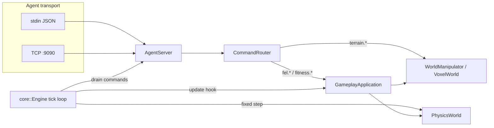

# FEL Gameplay Integration Manual

**Spec:** 06 NEXUS Integration Map · Phase 0/4  
**Source of truth:** `app/gameplay/`, `engine/ai_interface/`, `runtime/src/main.cpp`

This manual describes how the **app/gameplay** layer connects to the NEXUS engine, agent bridge, and iOS product shell.

## Architecture overview



## Frame order (engine tick)

Each `core::Engine::tick` cycle runs in this order:

1. **Poll input** — renderer/SDL event pump.
2. **Drain agent queue** — `AgentServer::processQueuedCommands` (max per frame from `EngineConfig`).
3. **Fixed physics step** — accumulator-based `PhysicsWorld::step`.
4. **Gameplay update** — `GameplayApplication::update(delta, physics, agentResponses)`.
5. **Render** — `VulkanRenderer::renderFrame`.

Agent commands received in step 2 are visible to gameplay in step 4 via the drained `AgentResponse` span. Fitness commands update `ThreadSafeFitnessData` immediately when routed; throw-catch physics reads the latest snapshot during the gameplay update.

## Wiring the gameplay handler

`CommandRouter` owns creative routing (`terrain.*`) and delegates FEL commands to `GameplayCommandHandler`:

| Prefix | Handler | Examples |
|--------|---------|----------|
| `fel.fitness.*` | `GameplayApplication::handleGameplayCommand` | `fel.fitness.update` |
| `fitness.*` | same (legacy alias) | `fitness.update_frc` |
| `fel.creative.*` | `VoxelCommandParser::apply_command` | `fel.creative.raise_terrain` |
| `fel.query.*` | `GameplayApplication::handleGameplayQuery` | `fel.query.get_session_state` |

Runtime bootstrap (`runtime/src/main.cpp`):

1. Init renderer, physics, `VoxelWorld`, `WorldManipulator`.
2. Init `CommandRouter` with manipulator + world.
3. Construct `GameplayApplication(manipulator, voxelWorld)`.
4. `router.setGameplayHandler(&gameplay)`.
5. Init `AgentServer`, start transport (stdin + TCP 9090).
6. `engine.init(..., &agentServer, &gameplay)` and `engine.run()`.

## Agent message envelope

Commands and queries use the NEXUS agent JSON envelope:

```json
{
  "type": "command",
  "id": "fitness_001",
  "payload": {
    "command": "fel.fitness.update",
    "params": {
      "frc_mobility": 0.75,
      "frc_active_range": 0.5,
      "frc_control": 0.25,
      "iap_engagement": 0.8,
      "iap_confidence": 0.9,
      "breath_phase": 1
    }
  }
}
```

Queries:

```json
{
  "type": "query",
  "id": "session_001",
  "payload": {
    "query": "fel.query.get_session_state"
  }
}
```

Successful responses use `"status": "ok"` with a JSON payload; failures use `"status": "error"` and `"error": "<message>"`.

## CMake target

| Target | Role |
|--------|------|
| `nexus_gameplay` | Static lib — all `app/gameplay/src/*.cpp` |
| `nexus_gameplay_test` | Unit tests in `tests/unit/gameplay/gameplay_test.cpp` |
| `nexus_runtime` | Links `nexus_engine` + `nexus_gameplay` |

Headless CI build (no GPU):

```bash
cmake -S . -B build-headless \
  -DNEXUS_ENABLE_RENDERER=OFF \
  -DNEXUS_BUILD_RUNTIME=OFF \
  -DCMAKE_BUILD_TYPE=Release
cmake --build build-headless
ctest --test-dir build-headless --output-on-failure
```

## iOS product shell (FinalEvolutionLab)

The shipping athlete app lives in `FinalEvolutionLab/`, not in `nexus_runtime`:

| Entry | File | Role |
|-------|------|------|
| `@main` | `FinalEvolutionLabApp.swift` | Firebase bootstrap, score manager, screenshot harness flag |
| Root UI | `ContentView.swift` | Tab bar (Lab, Train, Arena, Status, Profile), onboarding gate |
| Onboarding | `OnboardingView.swift` | Sport / age / goal → `LabViewModel.completeOnboarding` |
| Game modes | `GamePlayView.swift`, `ArenaHubView.swift` | SceneKit gameplay chrome + session receipts |

Native Swift sessions post results through `GameplaySessionReceiptCoordinator` (see `infra/GAMEPLAY_RECEIPT_CONTRACT.md`). Biometric streams on device (HealthKit, pose) are the intended producers of `fel.fitness.*` commands when a live NEXUS bridge is connected.

## Related specs

| Doc | Topic |
|-----|-------|
| [01_Gameplay_Loop_Protocol.md](./01_Gameplay_Loop_Protocol.md) | Throw-catch cycle, update hook |
| [02_Fitness_Data_Schema.md](./02_Fitness_Data_Schema.md) | FRC / IAP metrics, commands |
| [04_Creative_Mode_Protocol.md](./04_Creative_Mode_Protocol.md) | `fel.creative.*` terrain edits |

## Verification checklist

- [ ] `nexus_gameplay_test` passes (fitness, creative, session query, agent drain).
- [ ] `nexus_protocol_test` passes (router + schema).
- [ ] iOS `ContentView` shows onboarding on first launch (device); simulator auto-completes.
- [ ] Arena tab lists all registered modes (`GameMode` registry).
